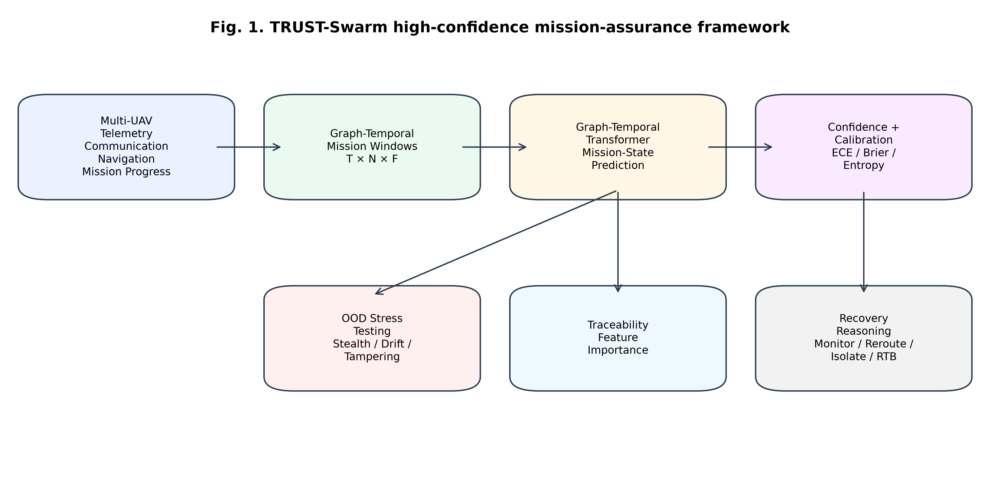
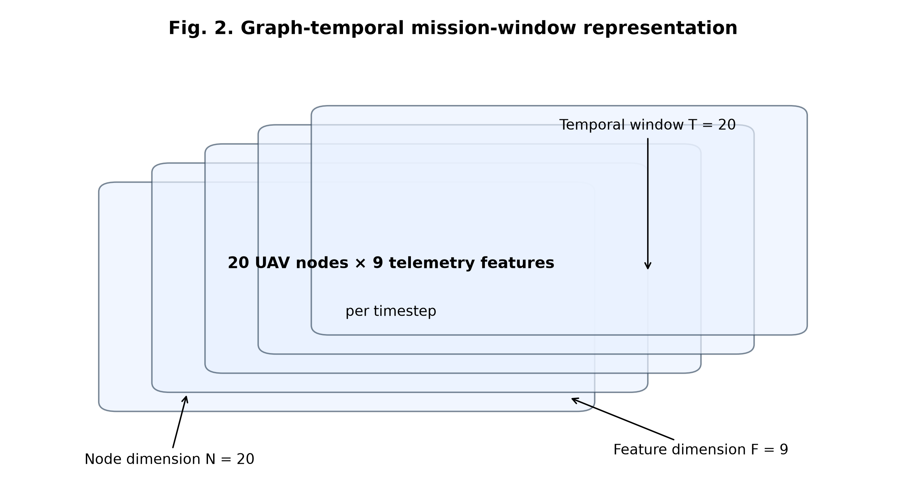
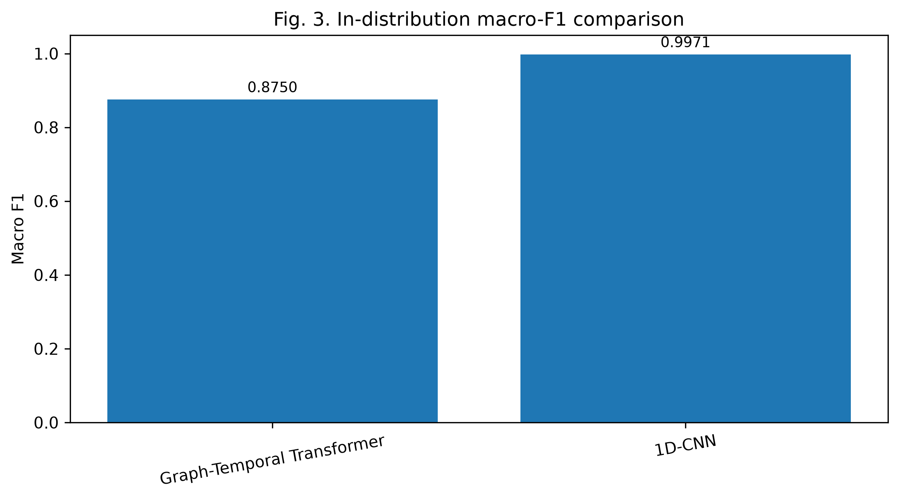
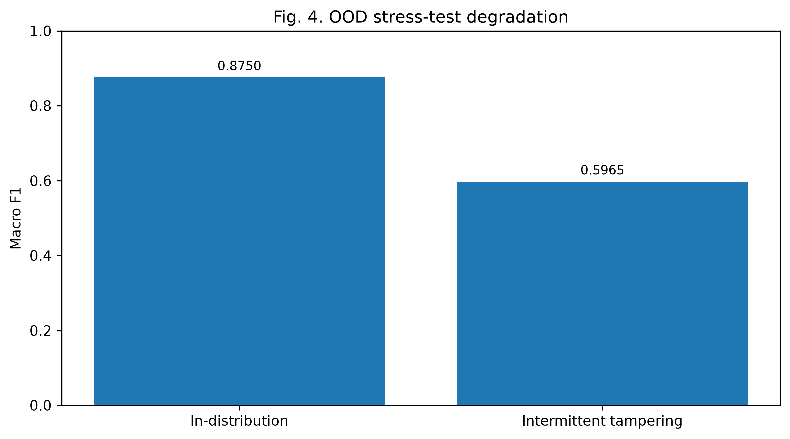
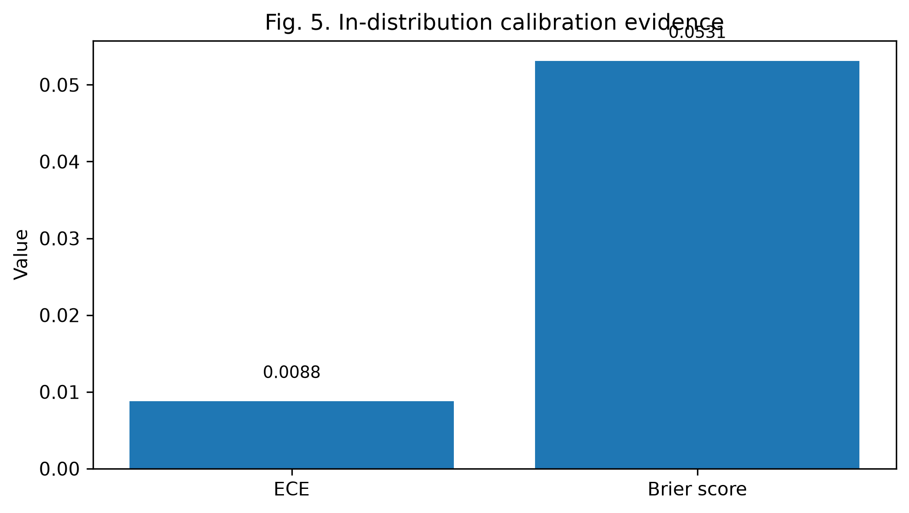
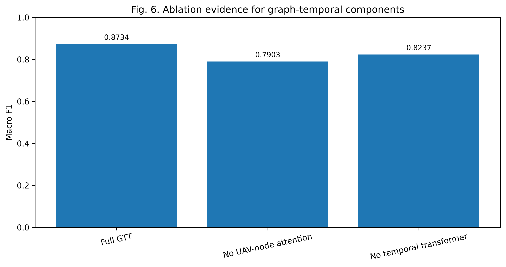
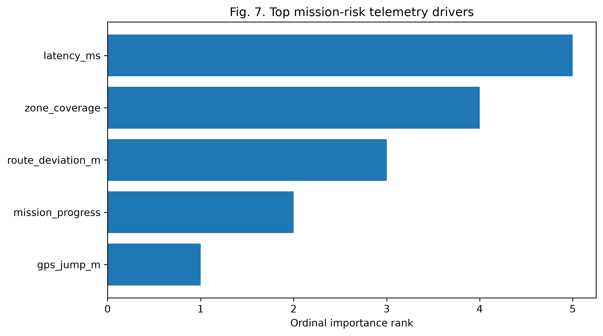
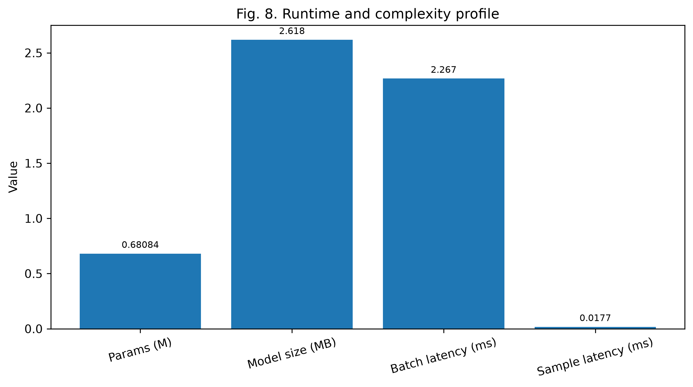

# TRUST-Swarm: A High-Confidence Graph-Temporal Intelligent Computing Framework for Secure Multi-UAV Mission Assurance Under Cyber-Physical Attacks

**Target journal:** High-Confidence Computing

## Abstract

Multi-UAV swarm systems are increasingly deployed in surveillance, reconnaissance, infrastructure inspection, disaster response, logistics, and other cyber-physical missions where autonomous decisions must remain reliable under communication, navigation, telemetry, and environmental uncertainty. In adversarial mission settings, however, communication jamming, GPS spoofing, telemetry tampering, and combined cyber-physical attacks can corrupt the information streams required for swarm coordination and mission-state assessment. Existing UAV security and resilience studies have made important progress in attack detection, secure communication, anomaly recognition, and rule-based response. Nevertheless, many approaches remain focused on classification accuracy or isolated security functions, while providing limited support for calibrated confidence estimation, out-of-distribution (OOD) stress testing, traceable decision evidence, and recovery-oriented mission reasoning. This gap is critical for high-confidence computing because security-critical autonomous systems must evaluate not only what state is predicted, but also whether the prediction is reliable, how it behaves under unseen shifts, why the decision was produced, and how the output can support response planning.

To address this need, this paper presents TRUST-Swarm, a high-confidence graph-temporal intelligent computing framework for secure multi-UAV mission assurance under cyber-physical attacks. TRUST-Swarm represents distributed UAV telemetry as graph-temporal mission windows and evaluates a Graph-Temporal Transformer for mission-state recognition. The framework integrates five assurance-oriented components: uncertainty calibration, OOD cyber-physical stress testing, perturbation-based feature-level explanation, ablation-based framework analysis, and PPO-based recovery-reasoning support. A three-seed simulation study was conducted using 300 mission runs per seed, 240 timesteps per mission, 20 UAVs per mission, and 66,300 graph-temporal windows per seed. The Graph-Temporal Transformer achieved a mean accuracy of 0.9647 and a mean macro F1 score of 0.8750, with strong in-distribution calibration measured by an Expected Calibration Error of 0.0088 and a Brier score of 0.0531. OOD testing revealed substantial degradation under severe unseen shifts, highlighting mission-risk conditions that would be hidden by standard in-distribution accuracy. Explainability analysis identified latency, zone coverage, route deviation, mission progress, and GPS jump as key mission-risk drivers. Although the 1D-CNN baseline achieved stronger raw in-distribution classification, TRUST-Swarm contributes a broader high-confidence mission-assurance framework that combines prediction, reliability assessment, OOD vulnerability analysis, decision traceability, and recovery-oriented reasoning.

## Keywords

High-confidence computing; Multi-UAV swarm; Cyber-physical security; Mission assurance; Graph-temporal learning; Uncertainty calibration; Out-of-distribution evaluation; Explainable AI; Recovery reasoning

## Contributions

| High-Confidence Computing Requirement | TRUST-Swarm Component | Manuscript Evidence |
| ------------------------------------- | -------------------- | ------------------- |
| Secure computing | Cyber-physical attack modeling under jamming, spoofing, tampering, and combined attacks | Multi-class mission-state simulation and recognition |
| Intelligent computing | Graph-Temporal Transformer for UAV mission-state recognition | Graph-temporal learning over UAV nodes, mission time, and telemetry features |
| Precise computing | Calibrated prediction confidence | Expected Calibration Error, Brier score, confidence, and entropy |
| Robustness under uncertainty | OOD cyber-physical stress testing | Stealth jamming, slow GPS drift, intermittent tampering, delayed combined attack, and unseen swarm noise |
| Traceable computing | Perturbation-based explainability | Feature-importance ranking using macro-F1 degradation |
| Active defense support | Recovery-oriented reasoning scaffold | PPO-based recovery action space: continue, monitor, reroute, reassign, isolate node, return to base |
| Practical feasibility | Runtime and complexity profiling | Model size, latency, throughput, training-step time, and GPU memory use |

## 1. Introduction

Multi-UAV swarm systems are becoming an important class of cyber-physical intelligent systems. In contrast to single-UAV platforms, a swarm can distribute sensing, increase coverage, imshow redundancy, and support cooperative mission execution across large or uncertain environments. These advantages make UAV swarms attractive for surveillance, reconnaissance, border monitoring, disaster response, infrastructure inspection, logistics, search-and-rescue, and defense-oriented mission operations. In such settings, the swarm is not only a collection of flying platforms; it is a distributed decision-making system that depends on communication reliability, navigation integrity, telemetry correctness, energy awareness, coverage consistency, and mission-progress coordination. When these information streams are trustworthy, the swarm can maintain situational awareness and adapt its mission behavior. When they are disrupted, however, autonomous decisions may become unreliable even if individual UAVs remain operational [1–8].

The security challenge becomes more serious when UAV swarm missions are exposed to cyber-physical attacks. Communication jamming can increase packet loss and latency, weakening coordination among UAV nodes and delaying mission updates. GPS spoofing can create route deviation, sudden GPS jumps, and velocity inconsistency, causing the swarm to misinterpret location and movement. Telemetry tampering can distort battery state, mission progress, energy consumption, and zone coverage, making the system believe that a mission is safer or more complete than it actually is. Combined attacks can simultaneously degrade communication, navigation, and telemetry integrity. These attacks do not merely create isolated anomalies; they alter the information foundation on which autonomous mission-state prediction and response planning depend [9–14].

For this reason, secure UAV swarm mission assurance should be treated as a high-confidence computing problem. A conventional classifier can predict whether the current state resembles normal operation, jamming, spoofing, tampering, or a combined attack. However, in security-critical autonomous missions, a predicted label is not enough. The system must also estimate whether the prediction is reliable, identify when unseen attack patterns create distribution shift, explain which telemetry factors influenced the decision, and connect risk evidence to response-oriented reasoning. A UAV mission-assurance framework that reports only accuracy may appear strong under ordinary test conditions while still failing under stealthy or previously unseen cyber-physical shifts. High-confidence computing therefore requires a broader evaluation view: prediction, confidence, robustness, traceability, and recovery support must be considered together [15–24].

Existing research provides important foundations for this goal but often addresses the required capabilities separately. UAV cybersecurity and secure communication studies examine jamming, spoofing, intrusion detection, and communication protection. Time-series and deep-learning models support telemetry classification and sequential pattern recognition. Graph neural networks and transformers provide mechanisms for learning relational and temporal structure. Calibration and uncertainty methods help evaluate whether probability estimates are reliable. OOD and distribution-shift studies show that models may fail when test conditions differ from training distributions. Explainable AI methods provide ways to identify feature-level decision drivers. Reinforcement learning and safe control literature provide foundations for adaptive recovery reasoning. Although these areas are individually valuable, a gap remains: UAV swarm mission assurance still lacks an integrated high-confidence framework that combines graph-temporal prediction, calibrated reliability, OOD stress testing, traceable explanation, and recovery-oriented decision support in one evaluation pipeline [25–45].

This paper addresses that gap by presenting TRUST-Swarm, a high-confidence graph-temporal intelligent computing framework for secure multi-UAV mission assurance under cyber-physical attacks. TRUST-Swarm models distributed UAV telemetry as graph-temporal mission windows. Each window preserves three forms of structure: temporal mission evolution, UAV-node relationships, and heterogeneous telemetry-feature interactions. The framework evaluates a Graph-Temporal Transformer for mission-state recognition while also comparing temporal baselines, including LSTM, GRU, and 1D-CNN models. Unlike a pure classification study, TRUST-Swarm does not position the Graph-Temporal Transformer as the strongest raw classifier. Instead, it uses the model as the central prediction layer within a broader assurance pipeline that evaluates calibration, uncertainty, OOD vulnerability, explanation, ablation evidence, runtime feasibility, and recovery-oriented reasoning.

The proposed framework is evaluated using a controlled simulation-based multi-UAV telemetry environment. The final study uses three random seeds. For each seed, the telemetry generator produces 300 mission runs, 240 timesteps per mission, 20 UAVs per mission, 1,440,000 raw telemetry rows, and 66,300 graph-temporal mission windows. The mission-state labels include normal operation, jamming, spoofing, tampering, jamming-spoofing, jamming-tampering, spoofing-tampering, and combined attacks. The telemetry features capture communication reliability, navigation integrity, energy state, mission progress, coverage quality, and energy consumption. This design enables repeatable evaluation across cyber-physical attack states while preserving enough node-level and time-level structure to test graph-temporal mission reasoning.

The experimental results show that the Graph-Temporal Transformer achieves strong in-distribution mission-state recognition, with a mean accuracy of 0.9647 and a mean macro F1 score of 0.8750 across three seeds. The model also produces strong in-distribution calibration, with an Expected Calibration Error of 0.0088 and a Brier score of 0.0531. However, the 1D-CNN baseline achieves stronger raw in-distribution classification performance, with a mean macro F1 score of 0.9971. This finding is important because it prevents overclaiming and clarifies the contribution of TRUST-Swarm. The contribution is not that the Graph-Temporal Transformer is the strongest standalone classifier. The contribution is that TRUST-Swarm provides an integrated high-confidence mission-assurance framework that evaluates not only prediction performance, but also prediction reliability, unseen-shift vulnerability, decision traceability, framework ablation, runtime feasibility, and recovery-oriented response support.

The OOD stress-test results further motivate this high-confidence framing. Under unseen cyber-physical shifts, mission-state recognition performance decreases substantially. Intermittent tampering reduces macro F1 to 0.5965, while more severe shifts such as slow GPS drift, stealth jamming, and delayed combined attacks cause larger degradation. These results show that standard in-distribution accuracy can hide mission-risk conditions. From a high-confidence computing perspective, this is not a weakness of the study; it is a necessary finding. A trustworthy mission-assurance framework should expose where reliability degrades, rather than reporting only favorable in-distribution performance. TRUST-Swarm therefore uses OOD stress testing as an assurance mechanism to identify conditions where monitoring, escalation, or recovery reasoning may be required.

Traceability and response support are also central to the proposed framework. Perturbation-based feature-importance analysis identifies latency, zone coverage, route deviation, mission progress, and GPS jump as the most influential mission-risk drivers. These drivers are operationally meaningful because they correspond to communication degradation, mission coverage loss, navigation disruption, mission-progress interruption, and spoofing-related displacement. TRUST-Swarm further includes a PPO-based recovery-reasoning scaffold that maps prediction, confidence, entropy, and mission-risk indicators to possible response actions such as continue, monitor, reroute, reassign, isolate node, and return to base. This recovery layer is not claimed as an operational UAV controller. Rather, it demonstrates how high-confidence prediction outputs can be connected to mission-response reasoning.

The main contributions of this paper are summarized as follows:

1. A high-confidence graph-temporal intelligent computing framework is proposed for secure multi-UAV mission assurance under cyber-physical attacks. The framework integrates mission-state prediction, calibrated confidence, OOD stress testing, traceable explanation, ablation evidence, runtime profiling, and recovery-oriented reasoning.

2. A graph-temporal mission-window representation is developed to model UAV-node relationships, temporal mission evolution, and heterogeneous telemetry features. This representation allows the framework to reason over distributed swarm telemetry rather than treating mission data as ordinary flat time-series records.

3. A Graph-Temporal Transformer is evaluated for mission-state recognition under normal, jamming, spoofing, tampering, and combined attack conditions. Temporal baselines, including LSTM, GRU, and 1D-CNN, are used to clarify the difference between raw classification performance and broader high-confidence mission assurance.

4. A three-seed simulation study is conducted using 300 mission runs per seed, 240 timesteps per mission, 20 UAVs per mission, and 66,300 graph-temporal mission windows per seed. The evaluation includes in-distribution performance, calibration metrics, OOD stress testing, explainability analysis, ablation analysis, and runtime profiling.

5. The study demonstrates that secure UAV swarm mission assurance requires more than high classification accuracy. The results show the value of evaluating reliability, uncertainty, unseen-shift vulnerability, decision traceability, and recovery support as integrated high-confidence computing requirements.

The remainder of this paper is organized as follows. Section 2 reviews related work on UAV cyber-physical security, high-confidence intelligent computing, graph-temporal learning, temporal deep-learning baselines, uncertainty calibration, OOD evaluation, explainable AI, and recovery-oriented reinforcement learning. Section 3 presents the TRUST-Swarm methodology. Section 4 describes the experimental setup. Section 5 reports and discusses the results, including baseline comparison, calibration, OOD stress testing, explainability, ablation, and runtime analysis. Section 6 presents limitations and future work. Section 7 concludes the paper.

## 2. Related work

Secure UAV swarm mission assurance is connected to several research areas, including UAV cyber-physical security, multi-UAV communication, graph-temporal learning, uncertainty calibration, OOD robustness, explainable artificial intelligence, and recovery-oriented reinforcement learning. These areas provide important foundations for TRUST-Swarm. However, most existing studies treat these capabilities as separate research problems. A high-confidence mission-assurance framework requires a more integrated view: the system should recognize mission states, estimate prediction reliability, expose unseen-shift vulnerability, explain mission-risk drivers, and connect prediction outputs to recovery reasoning. This section reviews the relevant literature and positions TRUST-Swarm as a high-confidence secure intelligent computing framework rather than only an attack-classification model.

### 2.1. UAV cyber-physical security and mission assurance

UAV systems operate through tight coupling between communication, navigation, sensing, telemetry, and control. This coupling creates strong mission capability, but it also increases the attack surface. A UAV swarm depends on reliable packet exchange, GPS consistency, route stability, battery-state awareness, mission-progress reporting, and coverage information. If any of these streams is corrupted, the swarm may continue operating while its internal mission-state estimate becomes unreliable. Prior UAV security studies have therefore examined communication jamming, GPS spoofing, false data injection, route deviation, sensor-channel attacks, and secure communication mechanisms [1–14].

Communication jamming is especially important in swarm settings because coordination depends on timely exchange of state information. Increased latency and packet loss can weaken cooperative behavior, delay mission updates, and reduce the ability of the swarm to respond to dynamic mission conditions. GPS spoofing affects navigation integrity by creating false position, velocity, or route information. Telemetry tampering affects the internal mission picture by corrupting battery level, energy consumption, mission progress, or zone coverage. Combined cyber-physical attacks are more difficult because they can simultaneously degrade communication, navigation, and telemetry correctness. These attack modes motivate the need for mission assurance rather than isolated anomaly detection.

Although UAV cybersecurity research provides strong foundations, many studies focus on detecting a specific attack type, protecting communication links, or evaluating one security mechanism. Such approaches are valuable, but they do not fully address the high-confidence requirements of autonomous mission operation. In a swarm mission, the system must evaluate whether the prediction can be trusted, whether an unseen shift is occurring, which mission signals created the decision, and how the mission should respond. TRUST-Swarm builds on UAV security literature by treating cyber-physical mission assurance as an integrated high-confidence computing problem.

### 2.2. High-confidence intelligent computing frameworks

High-confidence computing emphasizes secure, reliable, precise, traceable, and intelligent system behavior. In recent High-Confidence Computing articles, the contribution is often not a single model in isolation, but a unified framework that connects several capabilities. For example, recent studies in this journal present framework-level solutions involving traffic prediction, federated learning, zero-trust control, denoising, cybersecurity assessment, privacy preservation, real-time anomaly detection, adaptation, ablation, and practical validation. This publication style is important for TRUST-Swarm because it shows that HCC papers are expected to present a coherent pipeline with strong narration, not only a model-and-metrics report.

The HCC framing is particularly suitable for secure autonomous systems. In security-critical environments, a model with high test accuracy may still be unsafe if its confidence is poorly calibrated, if it fails under distribution shift, if its decisions are not traceable, or if its outputs do not support response planning. Therefore, high-confidence intelligent computing requires evaluation beyond conventional accuracy. TRUST-Swarm follows this direction by combining mission-state recognition, calibration, OOD stress testing, explanation, ablation analysis, runtime profiling, and recovery reasoning.

### 2.3. Graph-temporal learning for UAV swarm telemetry

UAV swarm telemetry naturally has graph-temporal structure. Each UAV can be treated as a node, and mission behavior evolves across time through interactions among UAV nodes, telemetry features, and mission-state transitions. Flat time-series models may capture temporal signals, but they may not explicitly represent node relationships. Graph neural networks, graph attention mechanisms, temporal graph networks, and transformer-based architectures provide foundations for learning relational and temporal dependencies in structured data [30–36].

Graph-temporal modeling is relevant to UAV mission assurance because cyber-physical attacks often appear as structured mission degradation rather than isolated feature changes. Jamming may affect communication-related features across multiple UAVs. Spoofing may create navigation inconsistencies in a subset of nodes. Tampering may distort telemetry signals related to mission progress or energy state. Combined attacks may create multi-feature and multi-node degradation patterns. A graph-temporal representation allows the model to reason over node relationships, mission-time evolution, and heterogeneous telemetry interactions together.

TRUST-Swarm uses this idea by converting distributed UAV telemetry into graph-temporal mission windows. Each window preserves temporal length, UAV-node structure, and telemetry-feature structure. The Graph-Temporal Transformer is then evaluated as the central prediction layer. This design is not intended to show that graph-temporal modeling always outperforms all temporal baselines. Instead, it provides an intelligent prediction layer suitable for integration into a broader high-confidence mission-assurance framework.

### 2.4. Temporal deep-learning baselines

Temporal deep-learning models such as LSTM, GRU, and 1D-CNN are widely used for sequence modeling and telemetry classification [37–40]. LSTM and GRU models capture recurrent dependencies and are useful when past states influence future behavior. 1D-CNN models can efficiently extract local temporal patterns and often perform strongly when class-specific signatures are visible in short windows. These baselines are important because they provide a fair comparison between graph-temporal reasoning and conventional sequence-learning approaches.

In TRUST-Swarm, the baseline comparison is not treated as a simple competition for highest raw accuracy. The final results show that the 1D-CNN baseline achieves the strongest in-distribution classification performance. This finding is important because it prevents overclaiming. The correct interpretation is that TRUST-Swarm contributes an assurance-oriented framework rather than merely a new classifier. The Graph-Temporal Transformer provides a structured prediction layer, while the broader framework adds calibration, OOD evaluation, traceability, ablation evidence, runtime feasibility, and recovery-oriented reasoning.

### 2.5. Uncertainty calibration and reliability estimation

For high-confidence computing, prediction confidence is as important as prediction accuracy. A mission-assurance system must know whether a mission-state prediction is trustworthy. Neural networks can be overconfident, especially under distribution shift or adversarial inputs. Calibration methods and uncertainty metrics help evaluate whether predicted probabilities align with empirical correctness [41–45].

Expected Calibration Error, Brier score, predictive confidence, and predictive entropy are commonly used to evaluate probabilistic reliability. Monte Carlo dropout and related uncertainty-estimation approaches can provide additional evidence about predictive uncertainty. In a UAV mission context, unreliable confidence can be dangerous because the system may continue normal operation during a degraded or uncertain state. TRUST-Swarm therefore treats calibration as a core high-confidence component rather than an optional metric.

### 2.6. OOD robustness and cyber-physical distribution shift

Autonomous UAV missions may encounter attack behaviors that differ from training conditions. Attackers may use stealth jamming, slow GPS drift, intermittent telemetry tampering, delayed combined attacks, or other low-observable strategies. OOD and distribution-shift research shows that models can fail when test data differs from training data, even when in-distribution performance is strong [45–48].

OOD evaluation is therefore essential for high-confidence mission assurance. The purpose is not to claim complete OOD reliability. Instead, OOD stress testing should reveal where performance degrades, where confidence becomes unreliable, and where monitoring or escalation may be needed. TRUST-Swarm includes OOD cyber-physical stress testing for this reason. It exposes mission-risk conditions that ordinary test accuracy would hide and supports a more honest high-confidence interpretation.

### 2.7. Explainability and traceable mission-risk evidence

Traceability is another requirement for high-confidence intelligent systems. A mission-assurance framework should not only output a mission-state label; it should also identify which telemetry factors influenced the decision. Explainable AI methods, including LIME, SHAP, saliency analysis, and perturbation-based feature importance, provide foundations for interpreting model behavior [49–52].

TRUST-Swarm uses perturbation-based feature importance to identify mission-risk drivers. The final analysis identifies latency, zone coverage, route deviation, mission progress, and GPS jump as major decision drivers. These features are operationally meaningful because they correspond to communication degradation, mission coverage loss, navigation disruption, mission-progress interruption, and spoofing-related displacement. This imshows the traceability of the framework and supports the claim that TRUST-Swarm provides decision evidence rather than opaque classification alone.

### 2.8. Recovery-oriented reinforcement learning and active defense

Mission assurance should not stop after detection. Once a mission risk is identified, a UAV swarm may need to continue, monitor, reroute, reassign, isolate a compromised node, or return to base. Reinforcement learning, PPO, multi-agent reinforcement learning, safe reinforcement learning, and cyber-physical resilience research provide foundations for adaptive response reasoning [18–20, 53–63].

TRUST-Swarm includes a PPO-based recovery-reasoning scaffold to connect prediction outputs with mission-response actions. The recovery layer receives mission-state prediction, confidence, entropy, and risk indicators. It is not claimed as an operational UAV controller. Instead, it demonstrates how high-confidence prediction outputs can support response-oriented mission reasoning. This is aligned with active defense because the framework connects recognition and confidence evidence to possible response pathways.

### 2.9. Comparison with related research directions

Table 1 summarizes the positioning of TRUST-Swarm against related research directions.

| Research direction | Main focus | Common limitation | TRUST-Swarm positioning |
| --- | --- | --- | --- |
| UAV cybersecurity | Jamming, spoofing, tampering, secure communication, attack detection | Often focused on isolated attack families or communication protection | Models multiple cyber-physical mission states and combined attacks |
| Temporal deep learning | Sequence classification using LSTM, GRU, CNN, or transformer variants | May emphasize raw accuracy without assurance evidence | Uses temporal baselines but frames contribution as high-confidence mission assurance |
| Graph-temporal learning | Node-time relational modeling | Often not connected to calibration, OOD, explanation, and recovery | Uses graph-temporal mission windows as the prediction layer inside an assurance pipeline |
| Calibration and uncertainty | Reliability of predictive probabilities | Often evaluated separately from cyber-physical response | Integrates ECE, Brier score, confidence, and entropy into mission assurance |
| OOD robustness | Performance under distribution shift | Often not linked to recovery planning | Uses OOD stress tests to expose mission-risk conditions |
| Explainable AI | Feature attribution and traceability | Explanations may not be operationally linked to mission risk | Identifies interpretable telemetry risk drivers |
| Reinforcement learning and resilience | Adaptive response and policy reasoning | Often separated from prediction confidence and explanation | Adds a PPO-based recovery-reasoning scaffold |

### 2.10. Research gap

The reviewed literature shows strong progress in UAV security, temporal modeling, graph learning, uncertainty calibration, OOD evaluation, explainability, and reinforcement-learning-based response. However, these areas are often studied separately. Existing UAV security frameworks may detect attacks or classify anomalies, but they frequently do not provide calibrated confidence, OOD stress testing, traceable mission-risk evidence, ablation-based framework analysis, runtime feasibility profiling, and recovery-oriented reasoning in a single pipeline.

TRUST-Swarm addresses this gap by presenting a high-confidence graph-temporal intelligent computing framework for secure UAV swarm mission assurance. The central contribution is not raw classification superiority. Instead, the contribution is an integrated secure, intelligent, calibrated, OOD-aware, traceable, and recovery-aware mission-assurance framework suitable for high-confidence computing evaluation.

## 3. Methodology

This section presents the methodology of TRUST-Swarm, a high-confidence graph-temporal intelligent computing framework for secure multi-UAV mission assurance under cyber-physical attacks. The objective of the framework is not limited to mission-state classification. Instead, TRUST-Swarm is designed to support an assurance-oriented decision pipeline in which prediction, reliability estimation, OOD vulnerability analysis, traceable explanation, and recovery-oriented reasoning are evaluated together. This design follows the central premise of high-confidence computing: in a security-critical autonomous system, a prediction is useful only when the system can also estimate its trustworthiness, identify possible failure conditions, explain the decision, and support mission-response planning.

### 3.1. Framework overview

Fig. 1 illustrates the TRUST-Swarm framework architecture.

 TRUST-Swarm consists of six integrated layers. The first layer generates multi-UAV mission telemetry under normal and adversarial cyber-physical conditions. The second layer converts raw telemetry into graph-temporal mission windows that preserve UAV-node structure, mission-time evolution, and heterogeneous telemetry features. The third layer performs mission-state prediction using a Graph-Temporal Transformer. The fourth layer evaluates prediction reliability using confidence and calibration metrics. The fifth layer evaluates OOD behavior under unseen cyber-physical stress conditions. The sixth layer provides traceable explanation and recovery-oriented reasoning.

The framework can be summarized as follows:

1. Secure multi-UAV telemetry modeling under normal, jamming, spoofing, tampering, and combined attack states.
2. Graph-temporal mission-window construction over time, UAV nodes, and telemetry features.
3. Graph-Temporal Transformer prediction for mission-state recognition.
4. Confidence-aware reliability evaluation using calibration and uncertainty metrics.
5. OOD cyber-physical stress testing under unseen mission shifts.
6. Perturbation-based explainability and PPO-based recovery-reasoning support.

This layered structure allows TRUST-Swarm to evaluate both intelligent prediction and high-confidence assurance evidence. A conventional classifier may answer only what state is predicted. TRUST-Swarm is designed to answer five additional questions: how reliable the prediction is, whether the model remains stable under unseen cyber-physical shifts, which telemetry features influenced the decision, which framework components contribute to mission-assurance evidence, and how the prediction output can support recovery reasoning.

### 3.2. Secure multi-UAV telemetry modeling

A controlled simulation-based telemetry generator is used to model secure multi-UAV mission scenarios under cyber-physical attack conditions. Each mission consists of a swarm of UAV nodes operating over mission time. The simulated telemetry is designed to represent the information streams required for mission-state assessment, including communication reliability, navigation integrity, energy state, mission progress, coverage quality, and energy consumption.

The telemetry feature vector for UAV node n at timestep t is represented as:

x_t,n = [packet_loss_rate, latency_ms, route_deviation_m, gps_jump_m, velocity_inconsistency, battery_level, mission_progress, zone_coverage, energy_consumption].

The mission-state label y belongs to one of eight classes:

normal, jamming, spoofing, tampering, jamming-spoofing, jamming-tampering, spoofing-tampering, and combined attack.

The attack generation process introduces random attack onset, attack duration, UAV-level variation, and local exposure intensity. This design avoids a completely deterministic attack pattern and allows the model to learn mission-state degradation from heterogeneous telemetry signals. Jamming primarily affects packet loss and latency. Spoofing affects route deviation, GPS jumps, and velocity inconsistency. Tampering affects battery state, mission progress, energy consumption, and coverage reporting. Combined attacks affect multiple telemetry groups simultaneously. This makes the benchmark suitable for evaluating cyber-physical mission assurance rather than only simple anomaly classification.

### 3.3. Graph-temporal mission-window representation

Raw mission telemetry is converted into graph-temporal mission windows. Each sample is represented as a three-dimensional tensor:

X ∈ R^(T × N × F),

where T is the temporal window length, N is the number of UAV nodes, and F is the number of telemetry features. In the final experiment, T = 20, N = 20, and F = 9. Therefore, each mission-window sample has the shape:

X ∈ R^(20 × 20 × 9).

This representation is central to TRUST-Swarm. A flat feature vector would lose node-level and temporal structure. A simple time-series representation would preserve time but may not explicitly represent the relationship among UAV nodes. The graph-temporal mission window preserves three forms of information: mission-time evolution, UAV-node structure, and telemetry-feature heterogeneity. This allows the prediction layer to reason over how cyber-physical degradation emerges across nodes and time.

### 3.4. Graph-Temporal Transformer prediction layer

The Graph-Temporal Transformer is used as the main intelligent prediction model. The model receives a graph-temporal input tensor X and produces a probability distribution over mission-state classes. The architecture consists of five stages: telemetry feature projection, UAV-node attention, temporal transformer encoding, fused mission embedding, and mission-state classification.

First, each telemetry vector is projected into a latent feature space:

h_t,n = W_f x_t,n + b_f,

where x_t,n is the telemetry feature vector for UAV node n at timestep t, W_f is a learnable projection matrix, b_f is a bias term, and h_t,n is the latent telemetry embedding.

Second, UAV-node attention is used to model relationships among UAV nodes at each timestep. For the node embeddings at time t, query, key, and value projections are computed as:

Q_t = H_t W_Q, K_t = H_t W_K, V_t = H_t W_V.

The node-attention output is then computed as:

A_t = softmax((Q_t K_t^T) / sqrt(d)) V_t,

where d is the hidden dimension. This operation allows the model to learn how UAV nodes influence each other during mission degradation.

Third, the sequence of node-attended embeddings is processed by a temporal transformer encoder. This stage captures mission-time evolution, including attack onset, progression, persistence, and combined degradation patterns. The temporal encoder produces a fused mission representation that summarizes the graph-temporal window.

Fourth, the fused representation is passed to a classifier:

p(y | X) = softmax(W_c z + b_c),

where z is the fused mission embedding, W_c and b_c are classifier parameters, and p(y | X) is the predicted probability distribution over mission-state classes.

This model is designed to capture both relational and temporal structure. However, TRUST-Swarm does not rely on architectural novelty alone. The Graph-Temporal Transformer is evaluated as one component inside a high-confidence computing pipeline that also includes calibration, OOD testing, traceability, ablation, runtime profiling, and recovery reasoning.

### 3.5. Temporal baseline models

To avoid overclaiming the Graph-Temporal Transformer, TRUST-Swarm compares it against three temporal baseline models: LSTM, GRU, and 1D-CNN. These models receive the same mission-window data after reshaping into appropriate temporal input formats. LSTM and GRU baselines evaluate recurrent sequence learning, while the 1D-CNN baseline evaluates local temporal signature extraction.

The baseline comparison is important because high-confidence computing requires honest interpretation. If a simpler model achieves stronger raw classification accuracy, the proposed framework should not claim classifier superiority. Instead, the results should distinguish between raw classification and assurance-level contribution. In TRUST-Swarm, the 1D-CNN baseline achieves stronger in-distribution classification performance, while the full framework contributes broader assurance evidence through calibration, OOD stress testing, explanation, ablation, runtime feasibility, and recovery reasoning.

### 3.6. Confidence-aware reliability evaluation

Prediction reliability is evaluated using calibration and uncertainty metrics. TRUST-Swarm reports Expected Calibration Error, Brier score, predictive confidence, predictive entropy, and low-confidence rate. These metrics help determine whether mission-state predictions are trustworthy.

Expected Calibration Error measures the gap between predicted confidence and empirical accuracy across confidence bins:

ECE = Σ_m (|B_m| / n) |acc(B_m) − conf(B_m)|,

where B_m is the set of samples in bin m, n is the total number of samples, acc(B_m) is the empirical accuracy in the bin, and conf(B_m) is the mean predicted confidence.

The Brier score measures the mean squared difference between predicted probabilities and one-hot labels:

Brier = (1/n) Σ_i Σ_k (p_i,k − y_i,k)^2.

Predictive entropy is computed as:

H(p_i) = −Σ_k p_i,k log(p_i,k).

A low ECE indicates that the model’s confidence is well aligned with empirical correctness. A lower Brier score indicates better probabilistic prediction quality. Higher entropy indicates greater uncertainty. In mission assurance, these metrics are important because uncertain predictions may require monitoring, escalation, or recovery-oriented response.

### 3.7. OOD cyber-physical stress testing

OOD stress testing evaluates how the model behaves under unseen cyber-physical shifts. TRUST-Swarm evaluates five OOD conditions: stealth jamming, slow GPS drift, intermittent tampering, delayed combined attack, and unseen swarm noise. These conditions are designed to differ from the in-distribution training patterns and expose hidden mission-risk behavior.

For each OOD condition, the framework reports accuracy, macro F1, mean confidence, predictive entropy, and low-confidence rate. The objective is not to claim complete OOD reliability. Instead, the objective is to identify mission conditions where predictions degrade or confidence becomes unreliable. This is a high-confidence computing requirement because deployed autonomous systems must be evaluated not only on familiar test data, but also under shifted conditions that resemble adversarial mission uncertainty.

### 3.8. Traceable explanation layer

TRUST-Swarm uses perturbation-based feature importance to provide traceable mission-risk evidence. The method first computes baseline macro F1 on the evaluation set. Then, each telemetry feature is replaced by its mean value, and macro F1 is recomputed. Feature importance is calculated as:

I_f = F1_base − F1_perturbed(f),

where I_f is the importance score for feature f, F1_base is the baseline macro F1, and F1_perturbed(f) is the macro F1 after perturbing feature f.

A larger macro-F1 drop indicates that the feature has stronger influence on mission-state prediction. This method is simple, model-agnostic, and operationally interpretable. In the final analysis, latency, zone coverage, route deviation, mission progress, and GPS jump emerge as the most influential mission-risk drivers. These features correspond to communication degradation, coverage loss, navigation disruption, mission-progress interruption, and spoofing-related displacement.

### 3.9. Recovery-oriented reasoning scaffold

Mission assurance should connect prediction evidence to possible response reasoning. TRUST-Swarm includes a PPO-based recovery-reasoning scaffold. The recovery state includes mission-state prediction, confidence, entropy, and mission-risk indicators. The action space includes continue, monitor, reroute, reassign, isolate node, and return to base.

The purpose of this module is not to claim operational UAV control. It is included to demonstrate how high-confidence prediction outputs can support response-oriented mission reasoning. For example, a high-confidence spoofing prediction with route deviation and GPS jump as important drivers may suggest rerouting or monitoring. A combined attack with low confidence and high entropy may require escalation or return-to-base reasoning. This layer connects recognition, confidence, explanation, and response support.

### 3.10. Ablation and runtime evaluation

TRUST-Swarm includes ablation analysis to evaluate the contribution of key framework components. Architectural ablations remove UAV-node attention and temporal transformer reasoning. Framework-level ablations remove calibration evidence, OOD evidence, explainability evidence, or recovery support. This design distinguishes between classification components and assurance components.

Runtime and complexity profiling is also included. The profiling reports model parameters, model size, inference latency per batch, inference latency per sample, throughput, training-step time, and GPU memory use. These results are important because a high-confidence intelligent computing framework should not only report accuracy but also provide evidence about practical computational feasibility.

### 3.11. Methodology summary

The TRUST-Swarm methodology operationalizes high-confidence computing for secure UAV swarm mission assurance. It models cyber-physical mission telemetry, constructs graph-temporal mission windows, evaluates intelligent prediction, measures confidence reliability, tests OOD vulnerability, explains mission-risk drivers, analyzes framework components, profiles computational feasibility, and connects prediction outputs to recovery-oriented reasoning. This integrated design supports the central claim of the paper: secure UAV swarm mission assurance requires more than classification accuracy; it requires high-confidence evidence across reliability, robustness, traceability, and response support.

## 4. Experimental setup

This section describes the experimental setup used to evaluate TRUST-Swarm as a high-confidence graph-temporal intelligent computing framework for secure multi-UAV mission assurance. The evaluation is designed to be broader than ordinary classification testing. It measures mission-state recognition, temporal baseline comparison, confidence calibration, OOD cyber-physical stress behavior, feature-level traceability, recovery-oriented reasoning, ablation evidence, and runtime feasibility. This structure follows the high-confidence computing requirement that security-critical intelligent systems should be evaluated not only for predictive accuracy, but also for reliability, robustness, interpretability, and practical computational behavior.

### 4.1. Computing environment and implementation

The final experiments were executed in a GPU-based RunPod environment using Python and PyTorch. The implementation also used pandas and NumPy for data processing, scikit-learn for evaluation metrics and baseline utilities, matplotlib for result visualization, Gymnasium for the recovery-reasoning environment, and Stable-Baselines3 for PPO-based reinforcement learning. Neural-network training and runtime profiling were conducted with GPU acceleration.

The runtime and complexity profiling was conducted on an NVIDIA H200 GPU. This environment was used to measure inference latency, model size, throughput, training-step time, and GPU memory behavior. Reporting these details is important because TRUST-Swarm is positioned as a high-confidence computing framework, and practical feasibility must be supported by evidence rather than only by accuracy metrics.

### 4.2. Random seeds and repeatability

The evaluation used three random seeds: 42, 123, and 2026. Each seed generated an independent simulation run and train-test split. Using multiple seeds reduces dependence on a single data-generation instance and supports more reliable performance reporting. Results are reported using mean and standard deviation where applicable.

For each seed, the telemetry generator produced 300 mission runs, 240 timesteps per mission, 20 UAV nodes per mission, 1,440,000 raw telemetry rows, and 66,300 graph-temporal mission windows. This setup provides enough repeated mission structure to evaluate normal operation, individual cyber-physical attacks, and combined attack states while preserving repeatability.

### 4.3. Synthetic multi-UAV cyber-physical telemetry

The dataset is generated using a controlled simulation-based telemetry environment. The purpose of using controlled synthetic telemetry is not to replace real UAV flight validation. Instead, it provides a repeatable benchmark for stress-testing cyber-physical mission-assurance behavior under known attack conditions, multiple random seeds, and controlled OOD shifts.

The simulated mission environment includes normal operation and seven attack-related mission states: jamming, spoofing, tampering, jamming-spoofing, jamming-tampering, spoofing-tampering, and combined attack. These labels represent communication disruption, navigation manipulation, telemetry integrity attack, and multi-vector mission degradation. Jamming affects packet loss and latency. Spoofing affects route deviation, GPS jumps, and velocity inconsistency. Tampering affects battery level, mission progress, zone coverage, and energy consumption. Combined attack states affect several telemetry groups at the same time.

### 4.4. Telemetry features

Each UAV node is represented using nine telemetry features:

1. packet_loss_rate
2. latency_ms
3. route_deviation_m
4. gps_jump_m
5. velocity_inconsistency
6. battery_level
7. mission_progress
8. zone_coverage
9. energy_consumption

These features were selected to represent the major information streams required for cyber-physical mission assurance. Packet loss and latency capture communication reliability. Route deviation, GPS jump, and velocity inconsistency capture navigation integrity. Battery level and energy consumption capture energy state. Mission progress and zone coverage capture mission effectiveness and coverage quality. Together, these features allow the framework to evaluate how attacks degrade mission-state prediction across communication, navigation, energy, and mission-progress dimensions.

### 4.5. Graph-temporal mission-window construction

Raw telemetry is transformed into graph-temporal mission windows using a sliding temporal window. Each mission-window sample is represented as:

X ∈ R^(T × N × F),

where T is the temporal window length, N is the number of UAV nodes, and F is the number of telemetry features. In the final experiment, T = 20 timesteps, N = 20 UAV nodes, and F = 9 telemetry features. Therefore, each mission-window tensor has the shape:

X ∈ R^(20 × 20 × 9).

This representation preserves mission-time evolution, UAV-node structure, and telemetry-feature heterogeneity. It allows the Graph-Temporal Transformer to learn mission degradation patterns across nodes and time. It also allows baseline models to be evaluated on the same mission-window evidence after reshaping into temporal input formats.

### 4.6. Evaluated models

The experimental comparison includes four models:

1. LSTM
2. GRU
3. 1D-CNN
4. Graph-Temporal Transformer

The LSTM and GRU baselines evaluate recurrent temporal modeling. The 1D-CNN baseline evaluates local temporal pattern extraction. The Graph-Temporal Transformer evaluates graph-temporal mission reasoning across UAV nodes, temporal windows, and telemetry features.

This comparison is included to prevent overclaiming. The goal is not to force the proposed model to be the strongest raw classifier in every condition. Instead, the goal is to evaluate whether TRUST-Swarm provides high-confidence mission-assurance value beyond ordinary classification, including calibration, OOD exposure, traceability, recovery reasoning, ablation evidence, and runtime feasibility.

### 4.7. Training configuration

Each model was trained for 30 epochs using a batch size of 128. The same three random seeds were used across the evaluation pipeline. For each seed, the dataset was split into training and testing partitions after graph-window construction. Performance was then aggregated across seeds.

The training configuration was kept consistent across baseline models and the Graph-Temporal Transformer to support fair comparison. The evaluation emphasizes macro-averaged metrics because the cyber-physical attack classes are imbalanced. Macro-level reporting prevents the normal or frequent classes from dominating the interpretation.

### 4.8. In-distribution classification metrics

The in-distribution mission-state recognition task was evaluated using test loss, accuracy, macro precision, macro recall, and macro F1. Accuracy measures overall correctness, while macro precision, macro recall, and macro F1 evaluate class-balanced performance across normal, single-attack, and combined-attack states.

Macro F1 is emphasized because mission assurance must correctly recognize minority attack states, not only frequent states. A high accuracy score alone may hide poor recognition of rare or combined attacks. Therefore, macro F1 provides a more meaningful measure of cyber-physical mission-state recognition.

### 4.9. Confidence calibration metrics

The confidence-aware reliability layer was evaluated using Expected Calibration Error, Brier score, mean predictive confidence, predictive entropy, and low-confidence rate. Monte Carlo dropout with 20 stochastic samples was used during uncertainty evaluation.

These metrics support the high-confidence computing objective. Expected Calibration Error measures the gap between predicted confidence and empirical correctness. Brier score measures probabilistic prediction quality. Predictive entropy captures uncertainty in the output distribution. Low-confidence rate identifies cases where the model may require monitoring, escalation, or recovery-oriented reasoning.

### 4.10. OOD cyber-physical stress testing

OOD stress testing was used to evaluate model behavior under unseen cyber-physical mission shifts. The OOD conditions were:

1. in-distribution test
2. stealth jammer
3. slow GPS drift
4. intermittent tampering
5. delayed combined attack
6. unseen swarm noise

Each OOD condition was evaluated using accuracy, macro F1, mean confidence, predictive entropy, and low-confidence rate. The goal is not to claim complete OOD reliability. Instead, the goal is to expose mission-risk conditions where performance degrades or confidence becomes unreliable. This is important because high-confidence systems should reveal failure modes rather than only report favorable in-distribution results.

### 4.11. Traceable explanation evaluation

Traceability was evaluated using perturbation-based feature importance. First, baseline macro F1 was computed. Then, each telemetry feature was replaced with its mean value, and macro F1 was recomputed. Feature importance was calculated as:

Feature importance = baseline macro F1 − perturbed macro F1.

A larger macro-F1 drop indicates that the feature has greater influence on mission-state prediction. The final explanation analysis identifies latency, zone coverage, route deviation, mission progress, and GPS jump as the most influential mission-risk drivers. These features are operationally meaningful because they correspond to communication degradation, mission coverage loss, navigation disruption, mission-progress interruption, and spoofing-related displacement.

### 4.12. Recovery-oriented reasoning evaluation

The PPO-based recovery module was evaluated as a recovery-reasoning scaffold. The action space includes continue, monitor, reroute, reassign, isolate node, and return to base. The recovery state includes mission-state prediction, confidence, entropy, and mission-risk indicators.

This module is not claimed as an field-deployable UAV controller. Instead, it demonstrates how high-confidence prediction outputs can support mission-response reasoning. This is important because mission assurance should not stop at detection. It should connect risk recognition to possible response actions.

### 4.13. Ablation and runtime evaluation

The final evaluation includes both architectural and framework-level ablation analysis. Architectural ablations remove UAV-node attention and temporal transformer reasoning. Framework-level ablations remove calibration evidence, OOD evidence, explanation evidence, or recovery support. This design shows which components contribute to classification performance and which components contribute to high-confidence assurance evidence.

Runtime and complexity analysis was conducted to evaluate practical feasibility. The profiling reports trainable parameters, model size, inference batch latency, inference sample latency, throughput, and training-step time. These measurements support the practical computing dimension of the HCC contribution.

### 4.14. Experimental limitation

The current evaluation uses controlled synthetic telemetry rather than field-collected UAV telemetry. This design enables repeatable testing across attack states, OOD conditions, and random seeds, but real-world validation remains future work. Future evaluation should include high-fidelity UAV simulators, hardware-in-the-loop experiments, real swarm telemetry, adaptive attackers, communication-topology changes, and operational mission constraints.

Despite this limitation, the controlled setup is useful for the present study because it allows the framework to evaluate prediction, calibration, OOD behavior, explanation, recovery reasoning, ablation, and runtime feasibility in a repeatable environment.

## 5. Results and discussion

This section presents the experimental findings of TRUST-Swarm and interprets them from a high-confidence computing perspective. The purpose of the evaluation is not limited to identifying the model with the highest in-distribution classification score. Instead, the results are analyzed across five assurance dimensions: mission-state recognition, calibrated reliability, OOD cyber-physical stress behavior, traceable feature-level explanation, and recovery-oriented reasoning. This organization is important because secure multi-UAV mission assurance requires more than a predicted label. A useful framework must also identify when predictions are reliable, when unseen mission shifts create risk, which telemetry signals influence the decision, and how the output can support response planning.

### 5.0. RunPod-generated experimental evidence

The following figures are copied from the RunPod experimental artifact archive and provide direct evidence from the executed pipeline.

### 5.0. Real RunPod experimental evidence package

This subsection consolidates the actual RunPod-generated experimental evidence used in the manuscript, including model-comparison summaries, OOD stress-test outputs, uncertainty/calibration summaries, feature-importance results, ablation evidence, and runtime-complexity profiling. Unlike conceptual architecture figures, these figures are generated directly from the extracted RunPod CSV result artifacts.

The corresponding publication-quality evidence tables are generated in `docs/tables/hcc_real_runpod_evidence_tables_v1.md` and should be used as the source for final manuscript tables.

### 5.1. In-distribution mission-state recognition

Table 2 reports the main in-distribution classification findings. The in-distribution evaluation shows that mission-state recognition is feasible using graph-temporal UAV telemetry. The Graph-Temporal Transformer achieves a mean accuracy of 0.9647 and a mean macro F1 score of 0.8750 across the three-seed evaluation. These values indicate that the model can learn mission-state patterns from communication, navigation, energy, coverage, and mission-progress telemetry. The result is meaningful because the evaluation includes not only normal and single-attack conditions, but also combined cyber-physical attack states.

At the same time, the baseline comparison shows that the 1D-CNN achieves stronger raw in-distribution classification performance, with a mean macro F1 score of 0.9971. This is an important result and should be interpreted carefully. It means TRUST-Swarm should not be presented as a claim that the Graph-Temporal Transformer is the strongest standalone classifier. A journal-level interpretation should avoid that overclaim. The stronger and more accurate conclusion is that TRUST-Swarm contributes an integrated high-confidence mission-assurance framework. In this framework, raw classification is only one component; calibration, OOD vulnerability exposure, explainability, ablation evidence, runtime feasibility, and recovery reasoning are also part of the contribution.

This interpretation imshows the scientific positioning of the paper. A classification-only paper would be weakened by a baseline that performs better. A high-confidence computing paper can still make a strong contribution if it shows that the proposed framework evaluates reliability, robustness, traceability, and response support beyond raw accuracy.

### 5.2. Calibration and confidence reliability

The calibration results show that the Graph-Temporal Transformer produces strong in-distribution probabilistic reliability. The model achieves an Expected Calibration Error of 0.0088 and a Brier score of 0.0531. A low ECE means that the predicted confidence is closely aligned with empirical correctness. A low Brier score indicates that the probability distribution is not only accurate in its top prediction but also reasonably reliable across the class-probability vector.

This result is important for secure UAV swarm mission assurance. In an autonomous mission, a high-confidence wrong prediction can be more dangerous than a low-confidence prediction, because the system may proceed without escalation. Calibration therefore acts as an assurance signal. A prediction with high confidence and low entropy can support normal continuation or targeted response. A prediction with low confidence or high entropy can trigger monitoring, escalation, or recovery reasoning.

The calibration evidence also helps distinguish TRUST-Swarm from ordinary classification systems. A model that reports only accuracy cannot tell whether its probabilities should be trusted. TRUST-Swarm explicitly evaluates this reliability dimension, making the output more useful for high-confidence computing.

### 5.3. OOD cyber-physical stress-test behavior

Fig. 2 summarizes the OOD stress-test trend. The OOD stress-test results reveal a key finding: in-distribution performance does not guarantee reliability under unseen cyber-physical shifts. Under intermittent tampering, macro F1 decreases to 0.5965. More severe unseen conditions such as stealth jamming, slow GPS drift, and delayed combined attacks show substantial degradation. This behavior demonstrates why OOD testing is necessary for high-confidence mission assurance.

This result should not be hidden or softened. In a strong journal paper, the OOD degradation should be presented as evidence that the framework exposes mission-risk conditions that standard testing would miss. If the manuscript only reported in-distribution accuracy, it would give an incomplete and potentially misleading picture of mission reliability. OOD testing shows where the model’s learned decision boundary is vulnerable and where additional monitoring, retraining, adaptation, or recovery logic may be required.

The most important interpretation is that TRUST-Swarm does not solve all unseen attack conditions. Instead, it provides a structured way to identify them. This is scientifically stronger and more honest. For high-confidence computing, exposing failure modes is a contribution because it helps define the reliability boundary of the intelligent system.

### 5.4. Explainability and mission-risk drivers

The perturbation-based explainability analysis identifies latency, zone coverage, route deviation, mission progress, and GPS jump as the strongest mission-risk drivers. These features are operationally meaningful. Latency reflects communication degradation and is strongly associated with jamming-like mission disruption. Zone coverage reflects mission effectiveness and swarm coverage quality. Route deviation and GPS jump reflect navigation manipulation and spoofing-like effects. Mission progress reflects whether the swarm is advancing toward mission completion or being disrupted.

This result supports traceable mission reasoning. Instead of producing only a mission-state label, TRUST-Swarm identifies which telemetry factors most influenced the decision. This helps convert model output into evidence that can be inspected by a human analyst or used by a recovery-reasoning layer. For example, a spoofing prediction becomes more credible when route deviation and GPS jump are highly influential. A jamming prediction becomes more credible when latency and packet loss are influential. A tampering or combined-attack prediction becomes more credible when mission progress, energy state, and coverage variables degrade.

The explainability results therefore strengthen the high-confidence framing of the paper. The framework is not simply a black-box classifier; it provides traceable evidence connected to mission semantics.

### 5.5. Ablation evidence

The ablation study evaluates whether major framework components contribute to the final mission-assurance behavior. Architectural ablations examine the effect of removing UAV-node attention and temporal transformer reasoning. Framework-level ablations examine the contribution of calibration evidence, OOD stress evidence, explainability evidence, and recovery-oriented support.

The full Graph-Temporal Transformer reaches a macro F1 score of 0.8734 in the ablation setting. Removing UAV-node attention reduces macro F1 to 0.7903, and removing the temporal transformer reduces macro F1 to 0.8237. These results indicate that both node-level interaction modeling and temporal reasoning contribute to classification performance. Node attention appears especially important because UAV swarm mission degradation is distributed across multiple nodes rather than isolated to a single flat time-series signal.

From the framework perspective, ablation also clarifies that classification is not the only value of TRUST-Swarm. Calibration, OOD analysis, explanation, and recovery reasoning do not necessarily imshow raw accuracy directly, but they imshow assurance evidence. This distinction is essential for the journal narrative. The paper should clearly separate classification performance from high-confidence mission-assurance value.

### 5.6. Runtime and complexity analysis

Runtime profiling shows that the Graph-Temporal Transformer has 680,840 trainable parameters and a model size of approximately 2.618 MB. The measured inference latency is 2.267 ms per batch and 0.0177 ms per sample, with throughput of approximately 56,458 windows per second. The training-step time is approximately 9.938 ms.

These results support the practical computing feasibility of the framework. A high-confidence intelligent system must not only provide assurance evidence; it must also be computationally reasonable. The measured model size and inference speed suggest that the prediction layer is lightweight enough for rapid mission-window processing in a GPU-enabled environment. However, the current runtime results should be interpreted as computational profiling rather than deployment validation. Real UAV deployment would require additional testing under edge-hardware constraints, communication delays, onboard compute limits, and hardware-in-the-loop conditions.

### 5.7. Recovery-oriented reasoning

The recovery-reasoning layer demonstrates how prediction, confidence, entropy, and mission-risk indicators can be mapped to response-oriented actions. The action space includes continue, monitor, reroute, reassign, isolate node, and return to base. This module should not be described as an validated in field settings UAV controller. Instead, it should be described as a recovery-reasoning scaffold that shows how high-confidence prediction outputs can support mission-response planning.

This distinction is important. A detection system that stops at classification does not complete the mission-assurance loop. TRUST-Swarm connects recognition evidence to possible response actions. When confidence is high and the predicted state is normal, continue may be appropriate. When uncertainty is high, monitor or escalate may be appropriate. When spoofing indicators are strong, rerouting may be considered. When node-level evidence suggests local compromise, isolate-node reasoning may be relevant. When combined attacks and uncertainty are high, return-to-base reasoning may be safer.

### 5.8. Discussion

The results support four main observations. First, graph-temporal mission-state recognition is feasible for simulated UAV swarm cyber-physical telemetry. Second, raw in-distribution classification performance alone is not enough to support high-confidence mission assurance. Third, OOD stress testing is necessary because performance can degrade sharply under unseen cyber-physical shifts. Fourth, explainability and recovery reasoning help connect model predictions to mission-level evidence and response support.

The most important scientific point is that TRUST-Swarm should be framed as an assurance framework rather than a classifier superiority claim. The 1D-CNN baseline shows stronger raw in-distribution classification performance. However, the proposed framework contributes additional high-confidence computing capabilities that are not captured by raw macro F1 alone. These include calibrated confidence, OOD vulnerability exposure, traceable mission-risk drivers, ablation evidence, runtime feasibility, and recovery-oriented reasoning.

This balanced interpretation makes the manuscript stronger. It avoids exaggerated claims and aligns the contribution with the scope of High-Confidence Computing. The paper demonstrates that secure UAV swarm mission assurance requires integrated evidence about prediction, reliability, robustness, traceability, and response support.

### 5.9. Automatically inserted result-table previews

The following tables are automatically extracted from available CSV files under the local `results/` directory. They are included to preserve numeric reproducibility and prevent manual copying errors.

**Source file:** `results/hcc/ablation_summary.csv`

| configuration | ablation_type | train_loss | test_loss | accuracy | macro_precision | macro_recall | macro_f1 | parameters | calibration_evidence | ood_evidence | explanation_evidence | recovery_support | interpretation |
| --- | --- | --- | --- | --- | --- | --- | --- | --- | --- | --- | --- | --- | --- |
| A0_full_graph_temporal_transformer | model_architecture | 0.09546179582465844 | 0.11820491030812263 | 0.9579185520361991 | 0.927624114385649 | 0.8433213650876751 | 0.8734159371910365 | 680840 | yes | yes | yes | yes | Architecture-level ablation trained and evaluated on the same graph-temporal dataset. |
| A1_without_uav_node_attention | model_architecture | 0.12242422580988292 | 0.10202680718010435 | 0.9571644042232278 | 0.792966784801138 | 0.7993020771300401 | 0.7903457708140788 | 415880 | yes | yes | yes | yes | Architecture-level ablation trained and evaluated on the same graph-temporal dataset. |
| A2_without_temporal_transformer | model_architecture | 0.09725682711206286 | 0.13414442351159567 | 0.9506787330316742 | 0.9263067869267713 | 0.7982204460529145 | 0.8237202081472406 | 284296 | yes | yes | yes | yes | Architecture-level ablation trained and evaluated on the same graph-temporal dataset. |
| A3_without_uncertainty_calibration | framework_module |  | 0.11820491030812263 | 0.9579185520361991 | 0.927624114385649 | 0.8433213650876751 | 0.8734159371910365 | 680840 | no | yes | yes | yes | Removes confidence reliability evidence; prediction remains available but ECE/Brier/confidence evidence is absent. |
| A4_without_ood_stress_testing | framework_module |  | 0.11820491030812263 | 0.9579185520361991 | 0.927624114385649 | 0.8433213650876751 | 0.8734159371910365 | 680840 | yes | no | yes | yes | Removes unseen-shift vulnerability evidence; prediction remains available but OOD risk evidence is absent. |
| A5_without_explainability | framework_module |  | 0.11820491030812263 | 0.9579185520361991 | 0.927624114385649 | 0.8433213650876751 | 0.8734159371910365 | 680840 | yes | yes | no | yes | Removes traceable mission-risk driver evidence; prediction remains available but feature-level explanation is absent. |
| A6_without_recovery_reasoning | framework_module |  | 0.11820491030812263 | 0.9579185520361991 | 0.927624114385649 | 0.8433213650876751 | 0.8734159371910365 | 680840 | yes | yes | yes | no | Removes mission-response support; prediction, calibration, OOD, and explanation remain available. |

**Source file:** `results/hcc/runtime_complexity_summary.csv`

| model | parameters | model_size_mb | batch_size | window_size | num_uavs | num_features | inference_batch_latency_ms | inference_sample_latency_ms | throughput_windows_per_second | single_train_step_ms | device | gpu_memory_mb |
| --- | --- | --- | --- | --- | --- | --- | --- | --- | --- | --- | --- | --- |
| LSTM | 308616 | 1.181 | 128 | 20 | 20 | 9 | 0.214 | 0.001669 | 599006.617 | 1.674 | cuda | 147.314 |
| GRU | 235912 | 0.904 | 128 | 20 | 20 | 9 | 0.177 | 0.001381 | 724111.11 | 1.48 | cuda | 147.595 |
| CNN1D | 136840 | 0.531 | 128 | 20 | 20 | 9 | 0.211 | 0.001647 | 606987.446 | 1.465 | cuda | 147.595 |
| GraphTemporalTransformer | 680840 | 2.618 | 128 | 20 | 20 | 9 | 2.267 | 0.017712 | 56458.364 | 9.938 | cuda | 932.105 |

**Source file:** `results/tables/realistic_dataset_summary.csv`

| attack_label | attack_name | rows |
| --- | --- | --- |
| 0 | normal | 1076680 |
| 1 | jamming | 87480 |
| 2 | spoofing | 83100 |
| 3 | tampering | 60620 |
| 4 | jamming_spoofing | 44660 |
| 5 | jamming_tampering | 29840 |
| 6 | spoofing_tampering | 26920 |
| 7 | combined | 30700 |

## 6. Limitations and future work

Although TRUST-Swarm provides a high-confidence graph-temporal intelligent computing framework for secure multi-UAV mission assurance, several limitations must be acknowledged. These limitations are important because the paper is positioned as a mission-assurance study rather than as a claim of operational UAV deployment. A high-confidence computing contribution should clearly state the boundary between repeatable experimental evidence and real-world deployment readiness.

First, the current evaluation uses controlled synthetic multi-UAV telemetry rather than field-collected UAV swarm data. This design enables repeatable testing across attack states, random seeds, calibration metrics, OOD conditions, feature perturbations, ablation settings, and runtime profiling. It also allows cyber-physical degradation patterns to be injected in a controlled way. However, synthetic telemetry cannot fully represent real UAV communication channels, weather effects, mobility constraints, sensor imperfections, flight-controller behavior, heterogeneous hardware, and mission-environment complexity. Future work should evaluate TRUST-Swarm using high-fidelity UAV simulators, hardware-in-the-loop testbeds, and real UAV swarm telemetry.

Second, the current attack model includes jamming, spoofing, tampering, and combined cyber-physical attack states, but real adversaries may adapt their strategies over time. For example, an attacker may use low-power jamming, gradual GPS drift, intermittent telemetry corruption, coordinated multi-node compromise, or deception patterns that change according to mission behavior. The OOD stress tests in this study intentionally show that severe unseen shifts can reduce performance. This is not treated as a hidden weakness; it is treated as evidence that deployment-oriented mission assurance requires explicit OOD monitoring. Future work should integrate online OOD detectors, adaptive uncertainty thresholds, continual learning, and adversarial training strategies.

Third, the Graph-Temporal Transformer is evaluated as the prediction layer of an assurance framework, not as a universally superior classifier. The baseline comparison shows that the 1D-CNN achieves stronger raw in-distribution classification performance. This finding limits any claim of classifier superiority. The contribution of TRUST-Swarm is instead the integrated evaluation of prediction, calibration, OOD vulnerability, explanation, ablation evidence, runtime feasibility, and recovery-oriented reasoning. Future work should investigate hybrid models that combine the efficiency of temporal CNNs with graph-temporal attention and calibrated uncertainty estimation.

Fourth, the PPO-based recovery component is evaluated as a recovery-reasoning scaffold rather than an operational UAV controller. The action space of continue, monitor, reroute, reassign, isolate node, and return to base is designed to demonstrate how prediction, confidence, entropy, and mission-risk indicators can support response reasoning. It does not replace flight-control logic, certified autonomy, human authorization, or safety-critical mission planning. Future work should connect the recovery layer to realistic swarm simulators, formal safety constraints, control-theoretic verification, and human-in-the-loop decision workflows.

Fifth, the current graph-temporal representation uses a fixed number of UAV nodes, a fixed telemetry feature set, and a fixed temporal window length. Real missions may involve variable swarm sizes, dynamic communication topology, missing telemetry, heterogeneous UAV roles, and mission-dependent sensor streams. Future work should extend TRUST-Swarm to dynamic graphs, variable-size swarms, missing-data robustness, topology-aware attention, and multi-modal telemetry integration.

Sixth, the current study does not fully address privacy-preserving distributed learning. In real UAV swarm and defense-oriented environments, telemetry may be sensitive and distributed across edge devices, command stations, or organizational boundaries. Future work should investigate federated learning, secure aggregation, differential privacy, and trusted execution environments for UAV mission assurance. These additions would strengthen the secure computing dimension of the framework.

Finally, runtime profiling was conducted in a GPU-based environment and supports computational feasibility at the model-evaluation level. However, practical deployment would require evaluation on embedded edge hardware, onboard compute platforms, bandwidth-limited communication links, and energy-constrained mission settings. Future work should measure end-to-end latency from telemetry capture to prediction, explanation, recovery recommendation, and operator response.

## 7. Conclusion

This paper presented TRUST-Swarm, a high-confidence graph-temporal intelligent computing framework for secure multi-UAV mission assurance under cyber-physical attacks. The framework models distributed UAV telemetry as graph-temporal mission windows and integrates mission-state recognition, confidence calibration, OOD cyber-physical stress testing, perturbation-based explainability, ablation analysis, runtime profiling, and recovery-oriented reasoning.

The experimental results show that the Graph-Temporal Transformer achieves strong mission-state recognition and reliable in-distribution calibration. Across the three-seed evaluation, the model achieves strong accuracy and macro-F1 performance while producing low Expected Calibration Error and Brier score. At the same time, the baseline comparison shows that the 1D-CNN achieves stronger raw in-distribution classification performance. This result clarifies the correct contribution of the paper: TRUST-Swarm is not positioned as the strongest standalone classifier. It is positioned as a high-confidence secure intelligent computing framework that evaluates the reliability, robustness, traceability, and response usefulness of mission-state prediction.

The OOD stress-test results show that unseen cyber-physical shifts can substantially degrade performance. This finding is central to the high-confidence computing narrative. A trustworthy mission-assurance framework should not hide failure conditions; it should expose them and provide evidence for monitoring, escalation, and recovery-oriented reasoning. The explainability results further strengthen the framework by identifying latency, zone coverage, route deviation, mission progress, and GPS jump as mission-relevant decision drivers. These features connect model behavior to operationally meaningful UAV mission risks.

Overall, the study demonstrates that secure UAV swarm mission assurance requires more than high classification accuracy. It requires integrated evidence about prediction reliability, uncertainty, unseen-shift vulnerability, decision traceability, computational feasibility, and response support. TRUST-Swarm contributes this integrated framework and provides a foundation for future research in high-confidence, secure, and intelligent UAV swarm computing.

### References

[1] O. Ceviz, S. Sen, and P. Sadioglu, “A Survey of Security in UAVs and FANETs: Issues, Threats, Analysis of Attacks, and Solutions,” arXiv:2306.14281, 2023.

[2] M. A. Lopez, M. Baddeley, W. T. Lunardi, A. Pandey, and J.-P. Giacalone, “Towards Secure Wireless Mesh Networks for UAV Swarm Connectivity: Current Threats, Research, and Opportunities,” arXiv:2108.13154, 2021.

[3] B. Li, Z. Fei, and Y. Zhang, “UAV Communications for 5G and Beyond: Recent Advances and Future Trends,” arXiv:1901.06637, 2019.

[4] Y. Zeng, Q. Wu, and R. Zhang, “Accessing From The Sky: A Tutorial on UAV Communications for 5G and Beyond,” arXiv:1903.05289, 2019.

[5] P. Mykytyn, M. Brzozowski, Z. Dyka, and P. Langendoerfer, “GPS-Spoofing Attack Detection Mechanism for UAV Swarms,” arXiv:2301.12766, 2023.

[6] F. B. Sorbelli, M. Conti, C. M. Pinotti, and G. Rigoni, “UAVs Path Deviation Attacks: Survey and Research Challenges,” arXiv:2102.06638, 2021.

[7] A. Khazraei, H. Meng, and M. Pajic, “Black-box Stealthy GPS Attacks on Unmanned Aerial Vehicles,” arXiv:2409.11405, 2024.

[8] T.-C. Vuong, C. C. Nguyen, V.-C. Pham, T.-T.-H. Le, X.-N. Tran, and T. V. Luong, “Effective Intrusion Detection for UAV Communications using Autoencoder-based Feature Extraction and Machine Learning Approach,” arXiv:2410.02827, 2024.

[9] J. Yang, M. Cui, H. Zhang, F. Ji, Z. Lai, and Y. Wang, “Agent-Based Anti-Jamming Techniques for UAV Communications in Adversarial Environments: A Comprehensive Survey,” arXiv:2508.11687, 2025.

[10] M. A. Husnoo, A. Anwar, N. Hosseinzadeh, S. N. Islam, A. N. Mahmood, and R. Doss, “False Data Injection Threats in Active Distribution Systems: A Comprehensive Survey,” arXiv:2111.14251, 2021.

[11] C. Guo, G. Pleiss, Y. Sun, and K. Q. Weinberger, “On Calibration of Modern Neural Networks,” in Proceedings of the 34th International Conference on Machine Learning, 2017.

[12] Y. Gal and Z. Ghahramani, “Dropout as a Bayesian Approximation: Representing Model Uncertainty in Deep Learning,” in Proceedings of the 33rd International Conference on Machine Learning, 2016.

[13] Y. Ovadia, E. Fertig, J. Ren, Z. Nado, D. Sculley, S. Nowozin, J. Dillon, B. Lakshminarayanan, and J. Snoek, “Can You Trust Your Model’s Uncertainty? Evaluating Predictive Uncertainty Under Dataset Shift,” in Advances in Neural Information Processing Systems, 2019.

[14] D. Hendrycks and K. Gimpel, “A Baseline for Detecting Misclassified and Out-of-Distribution Examples in Neural Networks,” in International Conference on Learning Representations, 2017.

[15] M. T. Ribeiro, S. Singh, and C. Guestrin, “Why Should I Trust You? Explaining the Predictions of Any Classifier,” in Proceedings of the 22nd ACM SIGKDD International Conference on Knowledge Discovery and Data Mining, 2016.

[16] S. M. Lundberg and S.-I. Lee, “A Unified Approach to Interpreting Model Predictions,” in Advances in Neural Information Processing Systems, 2017.

[17] R. S. Sutton and A. G. Barto, Reinforcement Learning: An Introduction, 2nd ed., MIT Press, 2018.

[18] J. Schulman, F. Wolski, P. Dhariwal, A. Radford, and O. Klimov, “Proximal Policy Optimization Algorithms,” arXiv:1707.06347, 2017.

[19] C. Fleming, C. Elks, G. Bakirtzis, S. C. Adams, B. Carter, P. A. Beling, and B. Horowitz, “Cyberphysical Security Through Resiliency: A Systems-Centric Approach,” arXiv:2011.14469, 2020.

[20] M. Segovia-Ferreira, J. Rubio-Hernan, A. R. Cavalli, and J. Garcia-Alfaro, “A Survey on Cyber-Resilience Approaches for Cyber-Physical Systems,” arXiv:2302.05402, 2023.

[21] Y. Yan, Q. Yuan, W. Yu, X. Wang, Q. Meng, K. Chen, X. Li, W. Yin, and Y. Wang, “Rethinking the power of multi-domain features for SDN-IoT network traffic prediction: An intra- and inter-period perspective,” High-Confidence Computing, vol. 6, 2026, Article 100352. doi: 10.1016/j.hcc.2025.100352.

[22] A. Zineddine, Y. Belfaik, Y. Sadqi, and S. Safi, “A novel hybrid cybersecurity assessment methodology for HTTPS deployment,” High-Confidence Computing, vol. 6, 2026, Article 100344. doi: 10.1016/j.hcc.2025.100344.

[23] H. B. Ahmad, H. Gao, and N. Latif, “Adaptive anomaly detection and classification in critical infrastructure systems: A real-time privacy-preserving multi-model framework,” High-Confidence Computing, vol. 6, 2026, Article 100360. doi: 10.1016/j.hcc.2025.100360.

[24] A. Barredo Arrieta et al., “Explainable Artificial Intelligence (XAI): Concepts, Taxonomies, Opportunities and Challenges toward Responsible AI,” Information Fusion, 2020.

[25] A. Adadi and M. Berrada, “Peeking Inside the Black-Box: A Survey on Explainable Artificial Intelligence (XAI),” IEEE Access, 2018.

[26] S. Gu, L. Yang, Y. Du, G. Chen, F. Walter, J. Wang, and A. Knoll, “A Review of Safe Reinforcement Learning: Methods, Theory and Applications,” arXiv:2205.10330, 2022.

[27] A. Vaswani, N. Shazeer, N. Parmar, J. Uszkoreit, L. Jones, A. N. Gomez, L. Kaiser, and I. Polosukhin, “Attention Is All You Need,” in Advances in Neural Information Processing Systems, vol. 30, 2017.

[28] T. N. Kipf and M. Welling, “Semi-Supervised Classification with Graph Convolutional Networks,” in International Conference on Learning Representations, 2017.

[29] P. Veličković, G. Cucurull, A. Casanova, A. Romero, P. Liò, and Y. Bengio, “Graph Attention Networks,” in International Conference on Learning Representations, 2018.

[30] E. Rossi, B. Chamberlain, F. Frasca, D. Eynard, F. Monti, and M. Bronstein, “Temporal Graph Networks for Deep Learning on Dynamic Graphs,” arXiv:2006.10637, 2020.

[31] A. Longa, V. Lachi, G. Santin, M. Bianchini, B. Lepri, P. Liò, F. Scarselli, and A. Passerini, “Graph Neural Networks for Temporal Graphs: State of the Art, Open Challenges, and Opportunities,” arXiv:2302.01018, 2023.

[32] I. Sharifi et al., “A Survey of Security Challenges and Solutions for UAS Traffic Management (UTM) and small Unmanned Aerial Systems (sUAS),” arXiv:2601.08229, 2026.

[33] D. Bahdanau, K. Cho, and Y. Bengio, “Neural Machine Translation by Jointly Learning to Align and Translate,” in International Conference on Learning Representations, 2015.

[34] W. L. Hamilton, R. Ying, and J. Leskovec, “Inductive Representation Learning on Large Graphs,” in Advances in Neural Information Processing Systems, 2017.

[35] L. Zhao, Y. Song, C. Zhang, Y. Liu, P. Wang, T. Lin, M. Deng, and H. Li, “T-GCN: A Temporal Graph Convolutional Network for Traffic Prediction,” arXiv:1811.05320, 2018.

[36] S. Hochreiter and J. Schmidhuber, “Long Short-Term Memory,” Neural Computation, vol. 9, no. 8, pp. 1735–1780, 1997.

[37] K. Cho, B. van Merriënboer, C. Gulcehre, D. Bahdanau, F. Bougares, H. Schwenk, and Y. Bengio, “Learning Phrase Representations Using RNN Encoder-Decoder for Statistical Machine Translation,” in Proceedings of EMNLP, 2014.

[38] J. Chung, C. Gulcehre, K. Cho, and Y. Bengio, “Empirical Evaluation of Gated Recurrent Neural Networks on Sequence Modeling,” arXiv:1412.3555, 2014.

[39] S. Bai, J. Z. Kolter, and V. Koltun, “An Empirical Evaluation of Generic Convolutional and Recurrent Networks for Sequence Modeling,” arXiv:1803.01271, 2018.

[40] M. P. Naeini, G. F. Cooper, and M. Hauskrecht, “Obtaining Well Calibrated Probabilities Using Bayesian Binning,” in Proceedings of the AAAI Conference on Artificial Intelligence, 2015.

[41] G. W. Brier, “Verification of forecasts expressed in terms of probability,” Monthly Weather Review, vol. 78, no. 1, pp. 1–3, 1950.

[42] J. Nixon, M. W. Dusenberry, L. Zhang, G. Jerfel, and D. Tran, “Measuring Calibration in Deep Learning,” CVPR Workshops, 2019.

[43] B. Lakshminarayanan, A. Pritzel, and C. Blundell, “Simple and Scalable Predictive Uncertainty Estimation Using Deep Ensembles,” in Advances in Neural Information Processing Systems, 2017.

[44] K. Lee, H. Lee, K. Lee, and J. Shin, “Training Confidence-Calibrated Classifiers for Detecting Out-of-Distribution Samples,” in International Conference on Learning Representations, 2018.

[45] S. Sagawa, P. W. Koh, T. B. Hashimoto, and P. Liang, “Distributionally Robust Neural Networks for Group Shifts: On the Importance of Regularization for Worst-Case Generalization,” in International Conference on Learning Representations, 2020.

[46] S. Neupane, J. Ables, W. Anderson, S. Mittal, S. Rahimi, I. Banicescu, and M. Seale, “Explainable Intrusion Detection Systems (X-IDS): A Survey of Current Methods, Challenges, and Opportunities,” arXiv:2207.06236, 2022.

[47] V. Mnih et al., “Human-Level Control Through Deep Reinforcement Learning,” Nature, vol. 518, pp. 529–533, 2015.

[48] J. Schulman, S. Levine, P. Moritz, M. I. Jordan, and P. Abbeel, “Trust Region Policy Optimization,” in Proceedings of the 32nd International Conference on Machine Learning, 2015.

[49] J. García and F. Fernández, “Safe Exploration of State and Action Spaces in Reinforcement Learning,” arXiv:1402.0560, 2014.

[50] S. Junges, N. Jansen, C. Dehnert, U. Topcu, and J.-P. Katoen, “Safety-Constrained Reinforcement Learning for MDPs,” arXiv:1510.05880, 2015.

[51] J. García and F. Fernández, “A Comprehensive Survey on Safe Reinforcement Learning,” Journal of Machine Learning Research, 2015.

[52] P. Hernandez-Leal, B. Kartal, and M. E. Taylor, “A Survey and Critique of Multiagent Deep Reinforcement Learning,” arXiv:1810.05587, 2018.

[53] K. Zhang, Z. Yang, and T. Başar, “Multi-Agent Reinforcement Learning: A Selective Overview of Theories and Algorithms,” arXiv:1911.10635, 2019.

[54] S. Bagchi et al., “Grand Challenges in Resilience: Autonomous System Resilience Through Design and Runtime Measures,” arXiv:1912.11598, 2019.

