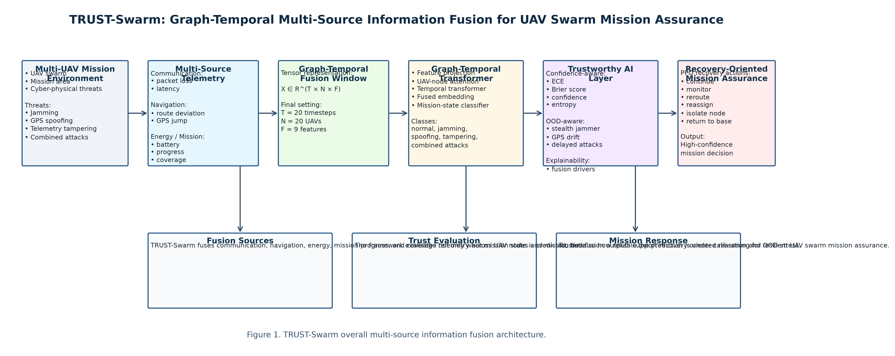
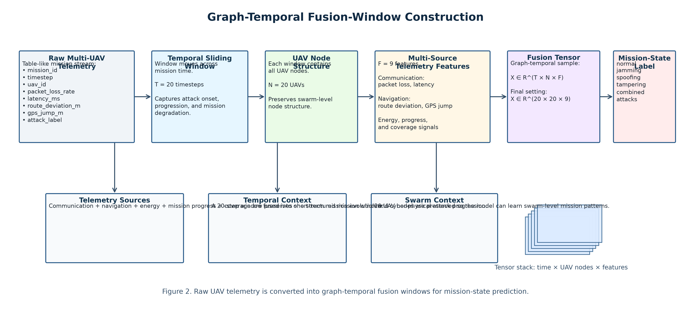
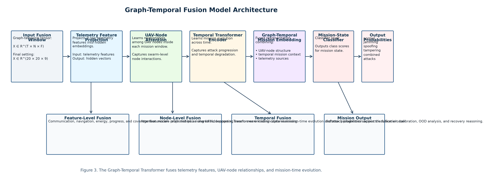
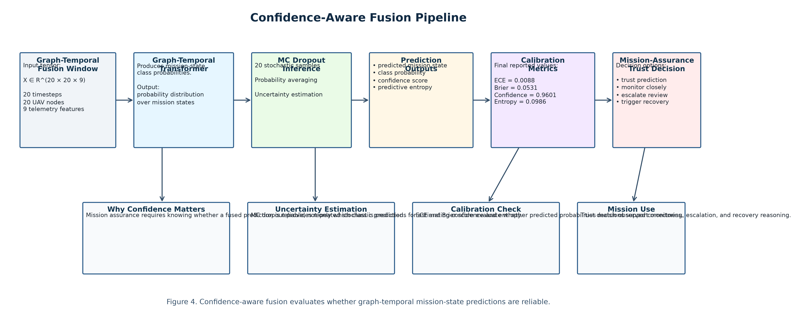
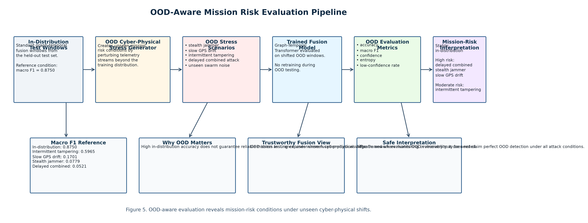
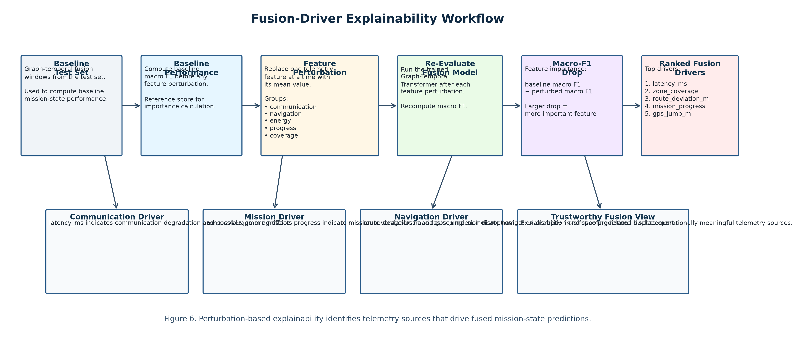
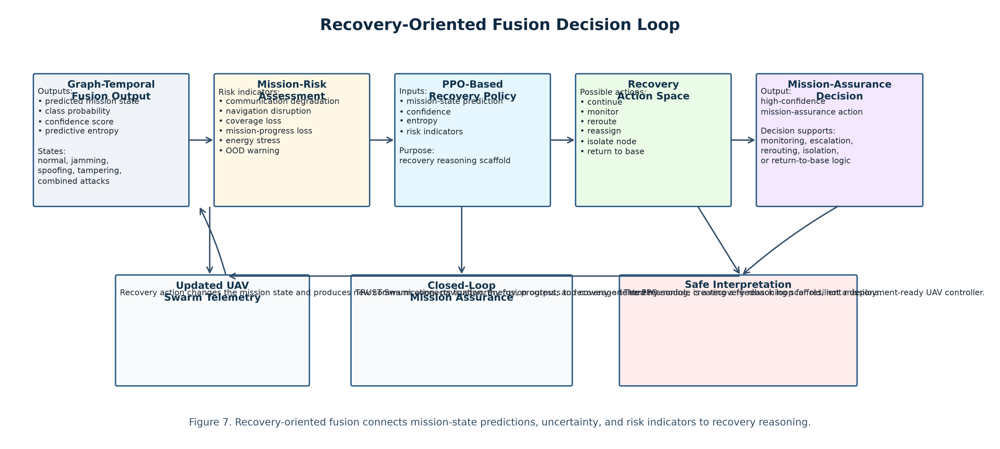
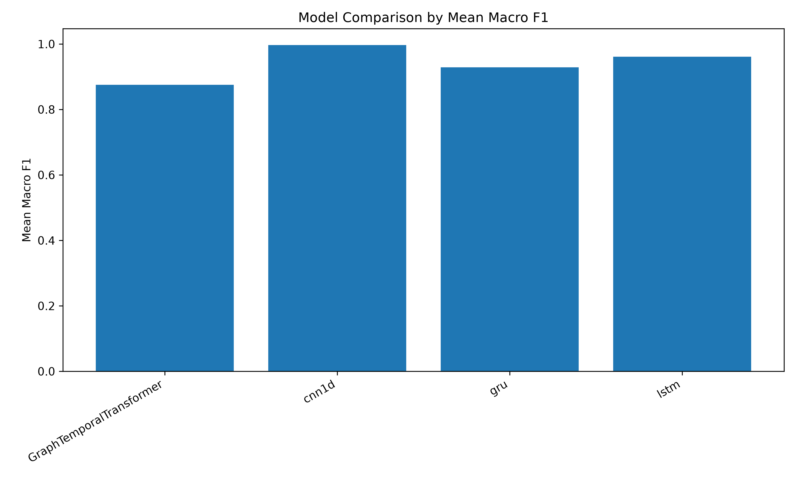
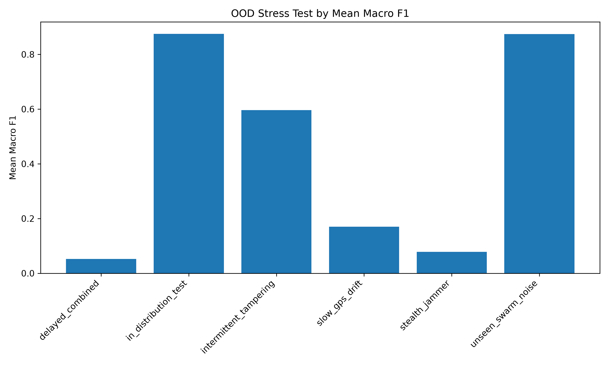
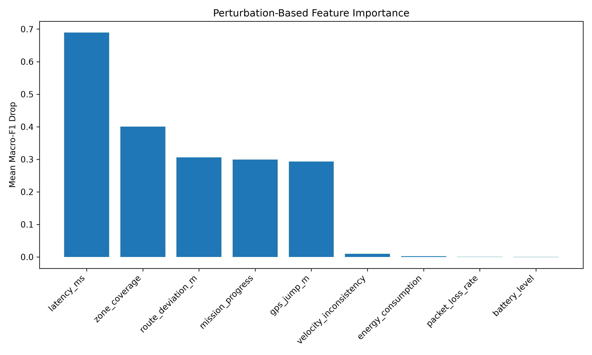

# TRUST-Swarm: Trustworthy Graph-Temporal Multi-Source Information Fusion for High-Confidence UAV Swarm Mission Assurance Under Cyber-Physical Attacks

## Abstract

Multi-UAV swarm missions depend on the continuous fusion of distributed and heterogeneous information streams, including communication telemetry, navigation behavior, energy state, mission progress, and coverage status. In contested cyber-physical environments, these information streams can be degraded or corrupted by communication jamming, GPS spoofing, telemetry tampering, and combined attack conditions. Existing UAV security and resilience studies often focus on attack detection or communication protection, but many provide limited support for confidence-aware information fusion, out-of-distribution stress testing, explainability, and recovery-oriented mission assurance.

This paper presents TRUST-Swarm, a trustworthy graph-temporal multi-source information fusion framework for high-confidence UAV swarm mission assurance under cyber-physical attacks. TRUST-Swarm represents UAV missions as graph-temporal fusion windows, where UAVs are modeled as dynamic nodes and heterogeneous telemetry signals are fused across time to estimate mission state under normal and adversarial conditions. The framework integrates graph-temporal learning, uncertainty calibration, OOD stress evaluation, perturbation-based explainability, and PPO-based recovery reasoning.

A three-seed simulation study was conducted using 300 mission runs per seed, 240 timesteps per mission, 20 UAVs per mission, and 66,300 graph-temporal fusion windows per seed. The Graph-Temporal Transformer achieved a mean accuracy of 0.9647 and a mean macro F1 score of 0.8750 across three seeds, while producing strong in-distribution calibration with an Expected Calibration Error of 0.0088 and a Brier score of 0.0531. OOD stress tests showed substantial degradation under severe unseen cyber-physical shifts, especially delayed combined attacks, stealth jamming, and slow GPS drift. Explainability analysis identified latency, zone coverage, route deviation, mission progress, and GPS jump as major fusion drivers.

Although a 1D-CNN baseline achieved stronger in-distribution classification performance, TRUST-Swarm provides a broader trustworthy information-fusion framework by combining graph-temporal mission modeling, calibrated confidence, OOD stress testing, explainability, and recovery-oriented reasoning. The results demonstrate that high-confidence UAV swarm mission assurance requires more than raw classification accuracy; it requires trustworthy fusion mechanisms that can evaluate prediction reliability, expose unseen-shift vulnerability, explain mission-relevant telemetry drivers, and support recovery decisions under cyber-physical uncertainty.

## Keywords

UAV swarms; information fusion; multi-source telemetry fusion; graph-temporal learning; mission assurance; cyber-physical attacks; jamming; GPS spoofing; telemetry tampering; uncertainty calibration; out-of-distribution evaluation; explainable AI; reinforcement learning; trustworthy AI.

## 1. Introduction

Multi-UAV swarm systems are increasingly used for surveillance, reconnaissance, disaster response, infrastructure monitoring, border security, logistics, and defense-oriented autonomous missions. Unlike single-UAV systems, UAV swarms provide distributed sensing, wide-area coverage, redundancy, cooperative decision-making, and adaptive mission execution. However, these advantages depend on the reliable fusion of heterogeneous mission information streams collected across UAV nodes and mission time.

A UAV swarm mission produces multiple forms of operational telemetry, including communication behavior, navigation state, energy condition, mission progress, and coverage quality. No single telemetry source is sufficient to determine mission reliability under cyber-physical stress. For example, communication latency may indicate jamming, GPS displacement may indicate spoofing, route deviation may indicate navigation disruption, zone-coverage loss may indicate mission degradation, and energy variation may indicate abnormal maneuvering or mission stress. Mission assurance therefore requires the joint interpretation of multiple information sources across both swarm topology and temporal mission evolution.

In contested cyber-physical environments, these information streams may be degraded, delayed, corrupted, or manipulated. Communication jamming can increase latency and packet loss, reducing inter-UAV coordination. GPS spoofing can cause localization jumps, route deviation, and velocity inconsistency. Telemetry tampering can distort mission-progress reporting, battery state, energy consumption, or coverage information. Combined attacks can simultaneously affect communication, navigation, and mission integrity. These disruptions create a high-confidence information-fusion problem: the system must estimate mission state while also evaluating whether its fused prediction is reliable.

Existing UAV security and resilience methods often focus on attack detection, secure communication, intrusion detection, anomaly monitoring, or rule-based recovery. While these methods are important, many of them treat mission telemetry as isolated time-series measurements or focus primarily on classification accuracy. Such approaches may not fully capture the graph-like structure of UAV swarms, the temporal evolution of mission degradation, the uncertainty of model predictions, the behavior of models under unseen distribution shifts, or the mission-relevant features driving the decision.

This limitation is critical for autonomous swarm operations. A high-confidence UAV mission-assurance system should not only classify whether the swarm is normal or under attack. It should also fuse distributed mission telemetry, estimate confidence, expose vulnerability under out-of-distribution attack shifts, explain the telemetry drivers behind the decision, and support recovery-oriented reasoning. Therefore, trustworthy UAV swarm mission assurance should be treated as a multi-source graph-temporal information-fusion problem rather than only a conventional attack-classification task.

To address this need, this paper presents TRUST-Swarm, a trustworthy graph-temporal multi-source information fusion framework for high-confidence UAV swarm mission assurance under cyber-physical attacks. TRUST-Swarm represents UAV missions as graph-temporal fusion windows, where UAVs are modeled as dynamic nodes and heterogeneous telemetry signals are fused across mission time. The framework integrates graph-temporal learning, uncertainty calibration, OOD stress evaluation, perturbation-based explainability, and PPO-based recovery reasoning.

The TRUST-Swarm evaluation uses a controlled simulation-based telemetry environment with three random seeds, 300 mission runs per seed, 240 timesteps per mission, 20 UAVs per mission, and 66,300 graph-temporal fusion windows per seed. The evaluated mission states include normal operation, jamming, spoofing, tampering, and combined cyber-physical attack scenarios. The evaluation also includes unseen OOD stress conditions, including stealth jamming, slow GPS drift, intermittent tampering, delayed combined attacks, and unseen swarm noise.

The final results show that the Graph-Temporal Transformer achieves strong in-distribution mission-state recognition and strong calibration. However, the 1D-CNN baseline achieves the strongest raw in-distribution classification performance, indicating that the synthetic telemetry environment contains strong local temporal signatures. Therefore, TRUST-Swarm is not positioned as merely the best raw classifier. Instead, it is positioned as a trustworthy information-fusion framework that combines graph-temporal mission modeling, calibrated confidence, OOD stress testing, explainability, and recovery reasoning.

The main contributions of this paper are as follows:

1. A trustworthy graph-temporal multi-source information fusion framework is proposed for UAV swarm mission assurance under cyber-physical attacks.

2. A graph-temporal fusion-window representation is developed to model distributed UAV telemetry across nodes, mission time, and heterogeneous telemetry sources.

3. A Graph-Temporal Transformer is evaluated for mission-state recognition under normal, jamming, spoofing, tampering, and combined attack conditions.

4. A three-seed large-scale simulation study is conducted using 300 mission runs per seed, 240 timesteps per mission, 20 UAVs per mission, and 66,300 graph-temporal fusion windows per seed.

5. Temporal baseline comparisons are performed against LSTM, GRU, and 1D-CNN models to evaluate in-distribution classification performance.

6. Confidence-aware fusion is evaluated using Expected Calibration Error, Brier score, predictive confidence, and predictive entropy.

7. OOD-aware fusion behavior is evaluated under unseen cyber-physical stress conditions, including stealth jamming, slow GPS drift, intermittent tampering, delayed combined attacks, and unseen swarm noise.

8. Perturbation-based explainability is used to identify the most influential mission telemetry fusion drivers, including latency, zone coverage, route deviation, mission progress, and GPS jump.

9. A PPO-based recovery-reasoning scaffold is included to connect fused mission-state outputs with mission-assurance recovery decisions.

The remainder of this paper is organized as follows. Section 2 reviews related work on UAV swarm security, cyber-physical attacks, graph-temporal learning, information fusion, uncertainty calibration, OOD evaluation, explainability, and recovery reasoning. Section 3 presents the TRUST-Swarm methodology. Section 4 describes the experimental setup. Section 5 presents the results and discussion. Section 6 discusses limitations and future work. Section 7 concludes the paper.

**Figure 1. TRUST-Swarm multi-source information fusion architecture.**

## 2. Related Work

This section reviews prior work related to UAV swarm mission assurance, cyber-physical UAV attacks, multi-source information fusion, graph-temporal learning, uncertainty calibration, OOD evaluation, explainability, and recovery-oriented reinforcement learning.

## 2.1 UAV Swarm Mission Assurance

UAV swarms provide distributed sensing, wide-area coverage, redundancy, and cooperative mission execution. These properties make them attractive for surveillance, reconnaissance, disaster response, infrastructure monitoring, border security, and defense-oriented missions. However, swarm autonomy also creates mission-assurance challenges because mission state depends on multiple UAV nodes, communication links, navigation signals, energy constraints, coverage progress, and operator objectives.

Prior UAV security and mission-assurance studies have examined UAS risks, sensor-channel threats, UAV-enabled systems, and cyber-physical vulnerabilities [1, 2, 34–37]. These works motivate the need for resilient monitoring and assurance mechanisms. However, many existing approaches focus on individual attack detection or secure communication rather than integrated mission-state fusion across heterogeneous telemetry sources.

## 2.2 Cyber-Physical Attacks on UAV Swarms

UAV swarms are exposed to cyber-physical attacks that can corrupt or degrade mission information streams. Communication jamming can increase latency and packet loss. GPS or GNSS spoofing can distort localization, route tracking, and velocity consistency. Telemetry tampering can manipulate mission progress, energy reporting, or coverage status. Combined attacks can affect multiple information channels simultaneously.

Prior work has studied GPS spoofing detection, cooperative swarm spoofing mitigation, UAV anti-jamming communication, and adversarial UAV planning [3, 4, 38–47]. These studies show that UAV mission assurance requires reasoning over communication, navigation, and mission-integrity signals together. TRUST-Swarm builds on this direction by modeling mission assurance as a graph-temporal multi-source fusion problem rather than only a single-attack classification task.

## 2.3 Multi-Source Information Fusion for Mission Awareness

Information fusion provides the foundation for combining heterogeneous data sources into decision-relevant representations. Classical multisensor fusion work has shown that combining multiple information sources can improve situational awareness, reliability, and decision support compared with isolated sensor interpretation [IF1–IF5]. High-level fusion models further emphasize the transformation of low-level measurements into mission-level awareness and decision-oriented reasoning [IF6–IF8, IF15].

In UAV swarm mission assurance, no single telemetry source is sufficient to determine mission reliability. Communication delay, packet loss, route deviation, GPS jumps, energy consumption, mission progress, and coverage loss must be interpreted jointly across UAV nodes and mission time. TRUST-Swarm operationalizes this idea by converting distributed UAV telemetry into graph-temporal fusion windows.

## 2.4 Uncertainty-Aware and Conflict-Aware Fusion

Cyber-physical mission telemetry may be noisy, incomplete, delayed, or adversarially corrupted. Therefore, trustworthy fusion requires not only combining data streams but also evaluating uncertainty and conflict among information sources. Evidence-theoretic and uncertainty-aware fusion methods provide a foundation for reasoning under uncertain or conflicting evidence [IF9–IF12].

TRUST-Swarm extends this idea into a deep graph-temporal setting by evaluating confidence, predictive entropy, Expected Calibration Error, and Brier score. This allows the framework to assess whether a fused mission-state prediction is reliable under in-distribution conditions and vulnerable under shifted conditions [18–24].

## 2.5 Multi-Source and Multi-Temporal Fusion

Multi-source and multi-temporal fusion is widely studied in domains where observations evolve over time and originate from heterogeneous sources [IF13, IF14]. UAV swarm mission assurance has a similar structure because each UAV contributes telemetry over time, and mission-level state emerges from the combined behavior of many nodes and features.

TRUST-Swarm represents this setting as a graph-temporal fusion tensor, preserving temporal structure, UAV-node structure, and feature-source structure. This enables the model to jointly reason over communication, navigation, energy, mission-progress, and coverage signals.

## 2.6 Graph-Temporal Learning for UAV Swarms

UAV swarms naturally form dynamic graph systems. UAVs can be represented as nodes, while communication, proximity, coordination, or shared mission context can define relationships. Graph neural networks, graph attention models, and graph-temporal approaches are therefore suitable for learning relational dependencies in multi-agent systems [5–10].

Transformers and temporal models provide additional support for capturing long-range mission evolution and temporal dependencies [11–13]. TRUST-Swarm combines these ideas by using a Graph-Temporal Transformer to learn both UAV-node relationships and mission-time evolution from graph-temporal fusion windows.

## 2.7 Temporal Deep Learning Baselines

Temporal deep learning models such as LSTM, GRU, and 1D-CNN are common baselines for sequence classification and telemetry analysis [14–17]. LSTM and GRU models capture recurrent temporal dependencies, while 1D-CNN models capture local temporal signatures efficiently.

In TRUST-Swarm, these models are used to evaluate whether conventional temporal models can classify mission-state patterns from the same telemetry windows. The strong 1D-CNN result shows that local temporal signatures are highly informative in the current synthetic telemetry setting. This supports careful claim positioning: TRUST-Swarm should be presented as a trustworthy information-fusion framework, not merely as the highest-accuracy classifier.

## 2.8 OOD Evaluation and Distribution Shift

Autonomous UAV missions may encounter unseen cyber-physical conditions that differ from training data. Attackers may use stealth jamming, slow GPS drift, intermittent tampering, delayed combined attacks, or noise patterns that were not observed during model training. Prior OOD and distribution-shift studies show that models can fail under shifted inputs even when they perform well in-distribution [22, 25–28, 54, 55].

TRUST-Swarm includes OOD-aware fusion stress testing to evaluate how fused mission-state predictions behave under unseen cyber-physical shifts. This is important because high in-distribution accuracy does not guarantee reliable mission assurance under adversarial or unfamiliar operating conditions.

## 2.9 Explainability for Fusion-Driver Analysis

Explainability is important for mission assurance because operators and downstream recovery modules need to understand which telemetry sources influenced a prediction. Prior explainable AI methods such as LIME, SHAP, saliency evaluation, and XAI frameworks support interpretation of model decisions [29–32]. Context-enhanced information fusion also emphasizes linking fused decisions to mission-relevant domain knowledge [IF15].

TRUST-Swarm uses perturbation-based feature importance to identify fusion drivers. The analysis reveals whether the model relies on operationally meaningful telemetry sources such as latency, zone coverage, route deviation, mission progress, and GPS jump.

## 2.10 Recovery-Oriented Reinforcement Learning

Mission assurance should not stop at mission-state prediction. When a risk is detected, a UAV swarm may need to continue, monitor, reroute, reassign, isolate a node, or return to base. Reinforcement learning, PPO, and multi-agent reinforcement learning provide foundations for adaptive mission planning and recovery-oriented reasoning [33, 48–53].

TRUST-Swarm includes a PPO-based recovery scaffold to demonstrate how fused mission-state predictions and confidence signals can support downstream mission-assurance decisions. The current recovery component is not a ready for operational deployment controller, but it provides an initial bridge between trustworthy information fusion and recovery reasoning.

## 2.11 Research Gap

The literature includes strong work on UAV security, cyber-physical attacks, information fusion, graph learning, temporal modeling, uncertainty estimation, OOD detection, explainability, and reinforcement learning. However, these areas are often studied separately. Existing UAV security systems may detect attacks, but they often do not integrate multi-source telemetry fusion, graph-temporal mission modeling, calibrated confidence, OOD stress testing, fusion-driver explainability, and recovery reasoning in one pipeline.

TRUST-Swarm addresses this gap by presenting a trustworthy graph-temporal multi-source information fusion framework for UAV swarm mission assurance. The framework evaluates not only mission-state classification, but also confidence reliability, unseen-shift vulnerability, telemetry-source importance, and recovery-oriented decision support.

## 3. Methodology

This section presents the TRUST-Swarm methodology as a trustworthy graph-temporal multi-source information fusion framework for UAV swarm mission assurance under cyber-physical attacks. The framework fuses distributed UAV telemetry across mission time, UAV nodes, and heterogeneous telemetry sources to estimate mission state and support high-confidence decision-making.

## 3.1 TRUST-Swarm Framework Overview

TRUST-Swarm treats UAV swarm mission assurance as a graph-temporal information fusion problem. Each UAV contributes telemetry streams related to communication, navigation, energy, mission progress, and coverage. These heterogeneous telemetry sources are fused across time and across UAV nodes to infer whether the mission is operating normally or under cyber-physical attack.

The framework includes the following components:

1. multi-source mission telemetry generation
2. graph-temporal fusion-window construction
3. temporal baseline modeling
4. graph-temporal fusion modeling
5. confidence-aware fusion calibration
6. OOD-aware fusion stress testing
7. fusion-driver explainability
8. recovery-oriented mission reasoning

The goal is not only to classify mission state, but also to estimate confidence, evaluate behavior under unseen cyber-physical shifts, explain which telemetry sources drive the fused decision, and connect fused mission-state outputs to recovery reasoning.

## 3.2 Multi-Source Mission Telemetry Generation

A controlled simulation-based telemetry generator was developed to create multi-UAV cyber-physical mission scenarios. Each mission contains a swarm of UAVs operating over time under normal or adversarial conditions. For each UAV and timestep, the generator produces telemetry features representing multiple mission information sources.

The telemetry sources include:

1. communication telemetry
2. navigation telemetry
3. energy telemetry
4. mission-progress telemetry
5. coverage telemetry

The nine telemetry features are:

1. packet_loss_rate
2. latency_ms
3. route_deviation_m
4. gps_jump_m
5. velocity_inconsistency
6. battery_level
7. mission_progress
8. zone_coverage
9. energy_consumption

These features represent mission-relevant information streams. Packet loss and latency describe communication degradation. Route deviation, GPS jump, and velocity inconsistency describe navigation integrity. Battery level and energy consumption describe energy state. Mission progress and zone coverage describe mission-level effectiveness.

The mission-state classes are:

1. normal
2. jamming
3. spoofing
4. tampering
5. jamming-spoofing
6. jamming-tampering
7. spoofing-tampering
8. combined attack

The telemetry generator introduces random attack onset, attack duration, UAV-level variation, jammer proximity, and local attack exposure. This allows the framework to evaluate multi-source fusion under controlled cyber-physical mission degradation.

## 3.3 Graph-Temporal Fusion-Window Construction

Raw UAV telemetry is converted into graph-temporal fusion windows. Each fusion window represents a short mission segment in which UAV nodes evolve over time with heterogeneous telemetry features.

Each sample is represented as:

X ∈ R^(T × N × F)

where:

* T is the temporal window length
* N is the number of UAV nodes
* F is the number of telemetry features

In the final experiment:

* T = 20 timesteps
* N = 20 UAV nodes
* F = 9 telemetry features

Each seed produced 66,300 graph-temporal fusion windows.

This representation supports multi-source mission fusion because it preserves three forms of structure:

1. temporal structure across mission time
2. relational structure across UAV nodes
3. feature-level structure across heterogeneous telemetry sources

## 3.4 Temporal Baseline Models

Three temporal baseline models were evaluated:

1. LSTM
2. GRU
3. 1D-CNN

The LSTM and GRU baselines model sequential telemetry patterns across time. The 1D-CNN baseline captures local temporal signatures in the graph-window telemetry. These baselines are included to determine how much of the mission-state information can be captured using conventional temporal models.

The final results show that the 1D-CNN baseline achieves the strongest in-distribution classification performance. This result is important because it shows that raw classification accuracy alone should not be the only measure of contribution. TRUST-Swarm is therefore positioned as a broader trustworthy information-fusion framework.

## 3.5 Graph-Temporal Fusion Model

The Graph-Temporal Transformer is used as the main graph-temporal fusion model. The model receives an input tensor of shape:

batch_size × window_size × num_uavs × num_features

The model first projects telemetry features into a hidden representation. It then applies UAV-node attention to model relationships across UAV nodes. A temporal transformer encoder is used to model mission evolution across time. The final fused representation is passed to a classifier to estimate mission-state class.

The graph-temporal fusion model learns:

1. UAV-node interaction patterns
2. temporal mission evolution
3. cyber-physical attack signatures
4. communication-navigation-energy-coverage interactions
5. mission-state degradation patterns

This design allows TRUST-Swarm to operationalize multi-source mission telemetry fusion through graph-temporal learning.

## 3.6 Confidence-Aware Fusion Calibration

High-confidence mission assurance requires calibrated confidence, not only accurate predictions. TRUST-Swarm evaluates whether fused model predictions are probabilistically reliable using:

1. Expected Calibration Error
2. Brier score
3. mean predictive confidence
4. predictive entropy

Monte Carlo dropout is used during uncertainty evaluation to estimate predictive uncertainty. This allows the mission-assurance layer to assess whether a fused prediction should be trusted, monitored, or escalated.

## 3.7 OOD-Aware Fusion Stress Testing

Real UAV missions may encounter cyber-physical shifts not observed during training. TRUST-Swarm therefore evaluates OOD-aware fusion behavior under unseen stress conditions.

The OOD scenarios are:

1. stealth jamming
2. slow GPS drift
3. intermittent tampering
4. delayed combined attack
5. unseen swarm noise

These conditions test whether the fused model remains reliable when mission telemetry is shifted or corrupted in unfamiliar ways. The evaluation reports accuracy, macro F1, confidence, entropy, and low-confidence rate.

The purpose is not to claim complete OOD reliability. Instead, OOD-aware fusion evaluation exposes mission-risk conditions where performance degrades or confidence becomes unreliable.

## 3.8 Fusion-Driver Explainability

TRUST-Swarm uses perturbation-based feature importance to identify which telemetry sources drive the fused decision. The method first computes baseline macro F1. Then, each feature is replaced by its mean value, and the resulting macro-F1 drop is measured.

A larger macro-F1 drop indicates that the feature is more important to the fused mission-state prediction.

This analysis identifies fusion drivers such as:

1. latency
2. zone coverage
3. route deviation
4. mission progress
5. GPS jump

These drivers are operationally meaningful because they represent communication degradation, mission coverage loss, navigation disruption, mission-progress interruption, and spoofing-related displacement.

## 3.9 Recovery-Oriented Mission Fusion Reasoning

TRUST-Swarm includes a PPO-based recovery-reasoning scaffold. The recovery module connects fused mission-state indicators, confidence signals, and mission-risk features to possible recovery actions.

The recovery action space includes:

1. continue
2. monitor
3. reroute
4. reassign
5. isolate node
6. return to base

This module should be interpreted as an initial recovery-reasoning layer, not as a complete operational UAV controller. Its purpose is to demonstrate how trustworthy information-fusion outputs can support downstream mission-assurance decisions.

## 3.10 Experimental Protocol

The final evaluation used three seeds: 42, 123, and 2026. For each seed, the telemetry generator produced:

* 300 mission runs
* 240 timesteps per mission
* 20 UAVs per mission
* 1,440,000 raw telemetry rows
* 66,300 graph-temporal fusion windows

Models were trained for 30 epochs with a batch size of 128. Results were aggregated across seeds using mean and standard deviation.

## 3.11 Summary

TRUST-Swarm reframes UAV swarm mission assurance as a graph-temporal multi-source information fusion problem. The framework fuses communication, navigation, energy, coverage, and mission-progress telemetry across UAV nodes and mission time. It then evaluates fused mission-state predictions using classification metrics, calibration metrics, OOD stress tests, explainability, and recovery reasoning.

This methodology supports the central claim that high-confidence UAV mission assurance requires trustworthy fusion mechanisms beyond raw classification accuracy.

**Figure 2. Graph-temporal fusion-window construction.**

**Figure 3. Graph-temporal fusion model architecture.**

**Figure 4. Confidence-aware fusion pipeline.**

**Figure 5. OOD-aware mission-risk evaluation pipeline.**

**Figure 6. Fusion-driver explainability workflow.**

**Figure 7. Recovery-oriented fusion decision loop.**

# TRUST-Swarm Experimental Setup Version

## 4. Experimental Setup

This section describes the experimental configuration used to evaluate TRUST-Swarm. The evaluation was designed to test in-distribution classification, uncertainty calibration, out-of-distribution attack behavior, explainability, and mission-assurance relevance under multi-UAV cyber-physical attack conditions.

## 4.1 Computing Environment

The final journal experiment was executed on a GPU-based RunPod environment. The training pipeline used Python, PyTorch, pandas, scikit-learn, matplotlib, Gymnasium, and Stable-Baselines3. CUDA was enabled during the final experiment, and all neural-network training was executed using GPU acceleration.

The full experiment was run using three random seeds: 42, 123, and 2026. The final experiment completed the full pipeline, including realistic telemetry generation, graph-window construction, baseline model training, Graph-Temporal Transformer training, uncertainty evaluation, OOD stress testing, explainability analysis, and results aggregation.

## 4.2 Dataset Configuration

A synthetic multi-UAV telemetry generator was used to create controlled mission scenarios under normal and adversarial conditions. For each random seed, the generator produced:

* 300 mission runs
* 240 timesteps per mission
* 20 UAVs per mission
* 1,440,000 raw telemetry rows
* 66,300 graph-temporal windows

Each graph-temporal window used:

* temporal window length: 20
* UAV nodes: 20
* telemetry features: 9
* mission-state classes: 8

The mission-state classes were:

1. normal
2. jamming
3. spoofing
4. tampering
5. jamming-spoofing
6. jamming-tampering
7. spoofing-tampering
8. combined attack

## 4.3 Telemetry Features

Each UAV was represented using nine telemetry features:

1. packet_loss_rate
2. latency_ms
3. route_deviation_m
4. gps_jump_m
5. velocity_inconsistency
6. battery_level
7. mission_progress
8. zone_coverage
9. energy_consumption

These features were selected because they represent communication degradation, navigation disruption, mission progress, mission coverage, and energy state.

## 4.4 Model Configuration

The evaluation compared the Graph-Temporal Transformer against three temporal baseline models:

1. LSTM
2. GRU
3. 1D-CNN

All models were trained using the same graph-window dataset for each seed. The training configuration was:

* epochs: 30
* batch size: 128
* seeds: 42, 123, 2026

The Graph-Temporal Transformer used UAV-node attention followed by temporal transformer encoding. The LSTM and GRU baselines processed flattened UAV telemetry across time. The 1D-CNN baseline used temporal convolution over windowed telemetry sequences.

## 4.5 Evaluation Metrics

The in-distribution classification metrics were:

* accuracy
* macro F1
* macro precision
* macro recall
* test loss

Macro-averaged metrics were emphasized because the dataset contained imbalanced attack classes.

## 4.6 Uncertainty Calibration Metrics

Uncertainty calibration was evaluated using:

* Expected Calibration Error
* Brier score
* mean predictive confidence
* mean predictive entropy

Monte Carlo dropout with 20 samples was used during uncertainty evaluation. The goal was to determine whether the Graph-Temporal Transformer produced reliable confidence estimates under in-distribution test conditions.

## 4.7 OOD Stress-Test Conditions

The OOD evaluation tested the model under unseen cyber-physical shifts. The evaluated conditions were:

1. in-distribution test
2. stealth jammer
3. slow GPS drift
4. intermittent tampering
5. delayed combined attack
6. unseen swarm noise

For each OOD condition, the following metrics were reported:

* accuracy
* macro F1
* mean confidence
* mean entropy
* low-confidence rate below 0.70

The purpose of OOD testing was to expose model behavior under unseen mission-risk conditions, not to claim complete OOD reliability.

## 4.8 Explainability Evaluation

Explainability was evaluated using perturbation-based feature importance. The baseline macro F1 score was first computed on the test set. Then, each telemetry feature was replaced with its dataset mean value, and the resulting macro-F1 drop was measured.

The feature-importance score was defined as:

macro-F1 drop = baseline macro F1 - perturbed macro F1

A larger drop indicates that the feature had greater influence on model predictions.

## 4.9 Results Aggregation

All final metrics were aggregated across the three random seeds. The aggregation reported mean and standard deviation for model comparison, uncertainty calibration, OOD stress testing, and feature importance.

This multi-seed design improves the reliability of the reported results by reducing dependence on a single random train-test split or telemetry generation seed.

## 4.10 Summary

The experimental setup was designed to evaluate TRUST-Swarm as a high-confidence mission-assurance framework. The evaluation included not only in-distribution classification but also calibration, OOD behavior, explainability, and recovery-oriented reasoning. This design supports the central claim that trustworthy UAV swarm mission assurance requires more than raw attack-classification accuracy.

This file contains manuscript-ready numbered tables for the TRUST-Swarm paper.

## Table 1. Experimental dataset configuration

| Configuration item              | Value         |
|:--------------------------------|:--------------|
| Random seeds                    | 42, 123, 2026 |
| Mission runs per seed           | 300           |
| Timesteps per mission           | 240           |
| UAVs per mission                | 20            |
| Raw telemetry rows per seed     | 1,440,000     |
| Graph-temporal windows per seed | 66,300        |
| Window length                   | 20 timesteps  |
| Telemetry features              | 9             |
| Mission-state classes           | 8             |
| Training epochs                 | 30            |
| Batch size                      | 128           |

## Table 2. Telemetry feature description

| Telemetry feature      | Mission meaning                                  |
|:-----------------------|:-------------------------------------------------|
| packet_loss_rate       | Communication degradation / packet loss          |
| latency_ms             | Communication delay and coordination degradation |
| route_deviation_m      | Navigation deviation from intended route         |
| gps_jump_m             | Sudden GPS displacement or spoofing indicator    |
| velocity_inconsistency | Inconsistent movement behavior                   |
| battery_level          | Remaining UAV energy state                       |
| mission_progress       | Mission completion progress                      |
| zone_coverage          | Coverage quality of assigned mission area        |
| energy_consumption     | Energy usage under mission conditions            |

## Table 3. Model comparison across three seeds

| model                    |   test_loss_mean |   test_loss_std |   accuracy_mean |   accuracy_std |   macro_f1_mean |   macro_f1_std |   macro_precision_mean |   macro_precision_std |   macro_recall_mean |   macro_recall_std |
|:-------------------------|-----------------:|----------------:|----------------:|---------------:|----------------:|---------------:|-----------------------:|----------------------:|--------------------:|-------------------:|
| GraphTemporalTransformer |           0.0933 |          0.0214 |          0.9647 |         0.0065 |          0.875  |         0.0143 |                 0.8935 |                0.0284 |              0.87   |             0.016  |
| cnn1d                    |           0.0042 |          0.0009 |          0.9987 |         0.0003 |          0.9971 |         0.0008 |                 0.9971 |                0.0017 |              0.9971 |             0.0017 |
| gru                      |           0.054  |          0.0211 |          0.9796 |         0.0107 |          0.9288 |         0.0471 |                 0.9469 |                0.0349 |              0.917  |             0.0534 |
| lstm                     |           0.0374 |          0.004  |          0.9871 |         0.0022 |          0.9608 |         0.0072 |                 0.9627 |                0.011  |              0.9597 |             0.005  |

## Table 4. Uncertainty calibration results

| model                    |   mc_samples_mean |   mc_samples_std |   accuracy_mean |   accuracy_std |   macro_f1_mean |   macro_f1_std |   expected_calibration_error_mean |   expected_calibration_error_std |   brier_score_mean |   brier_score_std |   mean_confidence_mean |   mean_confidence_std |   mean_predictive_entropy_mean |   mean_predictive_entropy_std |
|:-------------------------|------------------:|-----------------:|----------------:|---------------:|----------------:|---------------:|----------------------------------:|---------------------------------:|-------------------:|------------------:|-----------------------:|----------------------:|-------------------------------:|------------------------------:|
| GraphTemporalTransformer |                20 |                0 |          0.9655 |         0.0076 |          0.8808 |         0.0122 |                            0.0088 |                           0.0024 |             0.0531 |            0.0129 |                 0.9601 |                0.0056 |                         0.0986 |                        0.0117 |

## Table 5. OOD and unseen attack stress-test results

| condition              |   accuracy_mean |   accuracy_std |   macro_f1_mean |   macro_f1_std |   mean_confidence_mean |   mean_confidence_std |   mean_entropy_mean |   mean_entropy_std |   low_confidence_rate_lt_0_70_mean |   low_confidence_rate_lt_0_70_std |
|:-----------------------|----------------:|---------------:|----------------:|---------------:|-----------------------:|----------------------:|--------------------:|-------------------:|-----------------------------------:|----------------------------------:|
| delayed_combined       |          0.0305 |         0.0046 |          0.0521 |         0.0242 |                 0.9194 |                0.0289 |              0.231  |             0.0862 |                             0.0651 |                            0.0086 |
| in_distribution_test   |          0.9647 |         0.0065 |          0.875  |         0.0143 |                 0.9631 |                0.0076 |              0.0928 |             0.0188 |                             0.0422 |                            0.0148 |
| intermittent_tampering |          0.691  |         0.0309 |          0.5965 |         0.0518 |                 0.8916 |                0.0141 |              0.2486 |             0.0207 |                             0.1434 |                            0.0318 |
| slow_gps_drift         |          0.1253 |         0.0138 |          0.1701 |         0.051  |                 0.8875 |                0.0328 |              0.2721 |             0.0766 |                             0.1434 |                            0.0509 |
| stealth_jammer         |          0.0651 |         0.0197 |          0.0779 |         0.0236 |                 0.8652 |                0.0263 |              0.3449 |             0.0091 |                             0.1208 |                            0.1275 |
| unseen_swarm_noise     |          0.9645 |         0.0066 |          0.8744 |         0.0147 |                 0.9631 |                0.0076 |              0.0928 |             0.0189 |                             0.0422 |                            0.0147 |

## Table 6. Perturbation-based feature-importance results

| feature                |   baseline_macro_f1_mean |   baseline_macro_f1_std |   perturbed_macro_f1_mean |   perturbed_macro_f1_std |   macro_f1_drop_mean |   macro_f1_drop_std |
|:-----------------------|-------------------------:|------------------------:|--------------------------:|-------------------------:|---------------------:|--------------------:|
| latency_ms             |                    0.875 |                  0.0143 |                    0.1856 |                   0.0218 |               0.6894 |              0.0311 |
| zone_coverage          |                    0.875 |                  0.0143 |                    0.4749 |                   0.0331 |               0.4001 |              0.044  |
| route_deviation_m      |                    0.875 |                  0.0143 |                    0.5694 |                   0.1021 |               0.3056 |              0.0897 |
| mission_progress       |                    0.875 |                  0.0143 |                    0.576  |                   0.0533 |               0.299  |              0.0416 |
| gps_jump_m             |                    0.875 |                  0.0143 |                    0.5816 |                   0.0329 |               0.2934 |              0.0215 |
| velocity_inconsistency |                    0.875 |                  0.0143 |                    0.8654 |                   0.0275 |               0.0096 |              0.0142 |
| energy_consumption     |                    0.875 |                  0.0143 |                    0.8726 |                   0.0144 |               0.0024 |              0.0014 |
| packet_loss_rate       |                    0.875 |                  0.0143 |                    0.8747 |                   0.0145 |               0.0003 |              0.0002 |
| battery_level          |                    0.875 |                  0.0143 |                    0.8756 |                   0.0148 |              -0.0006 |              0.0009 |

## Table 7. OOD-safe interpretation and claim-positioning table

| Topic                  | Statement                                                                                                         | Recommendation   |
|:-----------------------|:------------------------------------------------------------------------------------------------------------------|:-----------------|
| Framework contribution | TRUST-Swarm integrates graph-temporal learning, calibration, OOD testing, explainability, and recovery reasoning. | Safe to claim    |
| Classifier superiority | Graph-Temporal Transformer is superior to all baselines.                                                             | Avoid            |
| Baseline result        | 1D-CNN achieved the strongest in-distribution classification performance.                                         | Safe to state    |
| OOD behavior           | OOD stress testing revealed severe degradation under unseen cyber-physical shifts.                                | Safe to claim    |
| OOD detection          | The model perfectly detects all OOD attacks.                                                                      | Avoid            |
| Recovery module        | PPO recovery is a recovery-reasoning scaffold.                                                                    | Safe to claim    |
| Deployment readiness   | TRUST-Swarm is ready for operational deployment for real UAV control.                                                             | Avoid            |

## Table 8. Limitations and future-work summary

| Limitation                    | Future work direction                                                                      |
|:------------------------------|:-------------------------------------------------------------------------------------------|
| Synthetic telemetry           | Use field telemetry, simulator-in-the-loop testing, or hardware-in-the-loop validation.    |
| Simplified graph construction | Add physics-aware dynamic communication graphs and RF propagation modeling.                |
| OOD degradation               | Add stronger OOD detection, ensembles, conformal prediction, and energy-based scoring.     |
| CNN baseline superiority      | Improve graph-temporal architecture and design harder graph-dependent benchmark scenarios. |
| PPO recovery scaffold         | Add safety constraints, richer reward design, and balanced recovery action learning.       |
| Controlled simulation setting | Validate with realistic swarm simulators and real UAV testbeds.                            |

## 5. Results and Discussion

This section evaluates TRUST-Swarm as a graph-temporal multi-source information fusion framework for high-confidence UAV swarm mission assurance. The analysis focuses on six questions:

1. Can graph-temporal fusion recognize cyber-physical mission states?
2. How does the fusion model compare with temporal baselines?
3. Are the fused predictions calibrated?
4. How does the framework behave under unseen OOD cyber-physical shifts?
5. Which telemetry sources drive the fused decisions?
6. How can fused mission-state outputs support recovery-oriented reasoning?

## 5.1 In-Distribution Mission-State Recognition

The Graph-Temporal Transformer achieved a mean accuracy of 0.9647 and a mean macro F1 score of 0.8750 across three seeds. The mean macro precision was 0.8935, and the mean macro recall was 0.8700. These results show that graph-temporal fusion can learn meaningful mission-state patterns from distributed UAV telemetry under cyber-physical attack conditions.

The model fused heterogeneous telemetry sources across UAV nodes and mission time, including communication, navigation, energy, mission-progress, and coverage signals. This supports the central idea that mission assurance should not depend on a single telemetry variable, but instead should jointly interpret multiple mission information streams.

## 5.2 Comparison with Temporal Baselines

The temporal baselines included LSTM, GRU, and 1D-CNN models. The 1D-CNN baseline achieved the strongest in-distribution classification performance, with a mean accuracy of 0.9987 and a mean macro F1 score of 0.9971. The LSTM baseline achieved a mean macro F1 score of 0.9608, while the GRU achieved a mean macro F1 score of 0.9288.

This result indicates that the synthetic telemetry environment contains strong local temporal signatures that can be captured effectively by convolutional temporal models. Therefore, the manuscript should not claim that the Graph-Temporal Transformer is the best raw classifier.

Instead, the correct interpretation is that TRUST-Swarm provides a broader trustworthy information-fusion framework. Its contribution is not limited to in-distribution classification. It combines graph-temporal mission modeling, confidence calibration, OOD stress evaluation, fusion-driver explainability, and recovery-oriented reasoning.

## 5.3 Confidence-Aware Fusion Calibration

The Graph-Temporal Transformer produced strong in-distribution calibration. Across three seeds, it achieved a mean Expected Calibration Error of 0.0088 and a mean Brier score of 0.0531. The mean predictive confidence was 0.9601, and the mean predictive entropy was 0.0986.

These results support the high-confidence information-fusion framing of TRUST-Swarm. A mission-assurance system should not only output a predicted mission state. It should also estimate whether the fused prediction is reliable. The low Expected Calibration Error suggests that the model’s confidence estimates are well aligned with in-distribution prediction correctness.

Confidence-aware fusion is especially important for autonomous UAV swarms because mission decisions may require escalation, monitoring, rerouting, or recovery actions when model confidence is uncertain.

## 5.4 OOD-Aware Fusion Stress Testing

OOD stress testing revealed substantial degradation under unseen cyber-physical shifts. The in-distribution macro F1 score was 0.8750. However, intermittent tampering reduced macro F1 to 0.5965. More severe OOD conditions caused larger reductions: slow GPS drift achieved a macro F1 score of 0.1701, stealth jamming achieved 0.0779, and delayed combined attacks achieved 0.0521.

These results show that unseen cyber-physical shifts can significantly alter the mission telemetry distribution. In operational UAV swarm missions, attackers may not follow the same patterns represented during training. Therefore, OOD-aware fusion evaluation is necessary for high-confidence mission assurance.

The OOD results should not be interpreted as complete OOD reliability. Some severe OOD cases may still produce high confidence. This means that confidence alone is not sufficient for robust mission assurance. Instead, TRUST-Swarm motivates the combined use of calibration, OOD stress testing, explainability, and recovery reasoning.

## 5.5 Fusion-Driver Explainability

Perturbation-based feature importance identified latency, zone coverage, route deviation, mission progress, and GPS jump as major fusion drivers. These features are operationally meaningful.

Latency reflects communication degradation and possible jamming. Zone coverage reflects mission-level effectiveness. Route deviation reflects navigation disruption. Mission progress reflects task completion under cyber-physical interference. GPS jump reflects spoofing-related displacement or localization instability.

This result strengthens the interpretability of TRUST-Swarm. The model’s most influential inputs correspond to mission-relevant risk indicators rather than arbitrary telemetry artifacts. For high-confidence UAV swarm assurance, this is important because operators and downstream decision modules need to understand why a mission-state prediction was produced.

## 5.6 Recovery-Oriented Fusion Reasoning

TRUST-Swarm includes a PPO-based recovery-reasoning scaffold. The recovery layer connects fused mission-state outputs, confidence signals, and mission-risk indicators to possible recovery actions such as continue, monitor, reroute, reassign, isolate node, or return to base.

The recovery module should be interpreted as an initial mission-assurance scaffold rather than a complete operational UAV controller. Its purpose is to demonstrate how fused predictions can support downstream recovery reasoning. Future work should extend this module with richer reward functions, safety constraints, realistic swarm dynamics, and simulator-in-the-loop validation.

## 5.7 Discussion

The final results show that TRUST-Swarm should be positioned as a trustworthy graph-temporal information-fusion framework rather than only a classifier. Although the 1D-CNN baseline achieved stronger in-distribution classification performance, it does not provide the same integrated analysis of calibrated confidence, OOD behavior, explainability, and recovery-oriented decision support.

The Graph-Temporal Transformer provides a structured way to fuse UAV-node telemetry across mission time. The calibration results show that the fused predictions are reliable under in-distribution conditions. The OOD stress tests reveal that severe unseen cyber-physical shifts remain challenging. The explainability results show that the model relies on mission-relevant telemetry drivers.

Together, these findings support the main claim of TRUST-Swarm: high-confidence UAV swarm mission assurance requires trustworthy fusion mechanisms beyond raw classification accuracy. A useful mission-assurance system must evaluate what mission state is predicted, how reliable the prediction is, how the system behaves under unseen shifts, which telemetry sources influenced the decision, and how the output can support recovery.

## 5.8 Safe Interpretation

The manuscript should state that TRUST-Swarm provides an integrated trustworthy information-fusion framework for UAV swarm mission assurance.

The manuscript should not claim that the Graph-Temporal Transformer is superior to all baselines.

The safest claim is:

TRUST-Swarm demonstrates how graph-temporal multi-source telemetry fusion, calibrated confidence, OOD stress testing, fusion-driver explainability, and recovery reasoning can be integrated for high-confidence UAV swarm mission assurance under cyber-physical attacks.

**Figure 8. Model comparison by mean macro F1.**

**Figure 9. OOD stress-test performance by mean macro F1.**

**Figure 10. Perturbation-based feature importance.**

## 6. Limitations and Future Work

Although TRUST-Swarm provides a strong simulation-based foundation for high-confidence UAV swarm mission assurance, several limitations should be acknowledged.

First, the evaluation is based on synthetic multi-UAV telemetry. The synthetic environment enables controlled testing across multiple seeds, mission runs, attack classes, and OOD stress conditions, but it does not fully replace field-collected UAV telemetry. Real-world UAV swarm operations may include more complex mobility patterns, communication-channel effects, RF propagation behavior, weather effects, hardware constraints, sensor drift, operator interventions, and environmental uncertainty.

Second, the current graph-temporal fusion representation models UAVs as structured mission nodes across time, but it does not yet implement a fully physics-aware dynamic communication graph. Future work should incorporate distance-aware edges, RF propagation models, line-of-sight constraints, jammer geometry, UAV mobility dynamics, and dynamic graph construction based on communication and mission context.

Third, OOD stress testing revealed substantial degradation under severe unseen cyber-physical shifts. This is an important finding because it shows that high in-distribution classification performance is not sufficient for reliable mission assurance. Some OOD conditions may still produce high confidence, indicating that confidence alone cannot fully guarantee safe operation under unseen attacks. Future work should integrate stronger OOD detection methods, conformal prediction, ensemble uncertainty, energy-based scoring, and hybrid statistical monitoring.

Fourth, the 1D-CNN baseline achieved the strongest in-distribution classification performance. This suggests that the current synthetic telemetry benchmark contains strong local temporal signatures. Therefore, TRUST-Swarm should not be framed as the best raw classifier. Instead, it should be framed as a trustworthy graph-temporal information-fusion framework that integrates mission-state recognition, calibrated confidence, OOD stress testing, fusion-driver explainability, and recovery reasoning.

Fifth, the PPO-based recovery component is currently a recovery-reasoning scaffold. It demonstrates how fused mission-state predictions and confidence signals can be connected to possible recovery actions, but it is not a complete operational UAV controller. Future work should improve reward design, add safety constraints, encourage balanced recovery actions, integrate realistic swarm simulators, and evaluate recovery policies under dynamic cyber-physical mission conditions.

Future research will extend TRUST-Swarm in five directions: field-realistic UAV telemetry, physics-aware graph construction, stronger OOD detection, safety-constrained recovery policies, and simulator-in-the-loop or hardware-in-the-loop validation.

## 7. Conclusion

This paper presented TRUST-Swarm, a trustworthy graph-temporal multi-source information fusion framework for high-confidence UAV swarm mission assurance under cyber-physical attacks. The framework represents UAV missions as graph-temporal fusion windows and jointly models communication, navigation, energy, mission-progress, and coverage telemetry across UAV nodes and mission time.

The final three-seed experiment evaluated TRUST-Swarm using 300 mission runs per seed, 240 timesteps per mission, 20 UAVs per mission, and 66,300 graph-temporal fusion windows per seed. The Graph-Temporal Transformer achieved strong in-distribution performance, with a mean accuracy of 0.9647 and a mean macro F1 score of 0.8750. It also produced strong calibration, with an Expected Calibration Error of 0.0088 and a Brier score of 0.0531.

The results also showed that the 1D-CNN baseline achieved stronger in-distribution classification performance than the Graph-Temporal Transformer. This finding is important because it supports a careful and honest interpretation of the contribution. TRUST-Swarm is not presented as the highest-performing raw classifier. Instead, its contribution is the integration of graph-temporal multi-source telemetry fusion, calibrated confidence, OOD stress testing, fusion-driver explainability, and recovery-oriented mission reasoning.

OOD stress tests demonstrated that unseen cyber-physical shifts, especially delayed combined attacks, stealth jamming, and slow GPS drift, can severely degrade mission-state recognition. These findings show that UAV swarm mission assurance must evaluate distribution-shift behavior rather than relying only on in-distribution test accuracy.

Fusion-driver explainability identified latency, zone coverage, route deviation, mission progress, and GPS jump as influential telemetry sources. These drivers are operationally meaningful because they correspond to communication degradation, mission coverage loss, navigation disruption, mission-progress interruption, and spoofing-related displacement.

Overall, TRUST-Swarm demonstrates how trustworthy graph-temporal information fusion can support high-confidence UAV swarm mission assurance under cyber-physical uncertainty. The framework provides a foundation for future research on field-realistic UAV telemetry, physics-aware swarm communication graphs, stronger OOD detection, explainable mission-risk reasoning, and safety-constrained autonomous recovery.

## References

[1] Shrestha, S., Ababneh, M., Misra, S., Cathey, H. M., Vishwanathan, R., Jansen, M., Choi, J., Bobba, R., & Jang, Y. (2025). A Comprehensive Survey of Unmanned Aerial Systems' Risks and Mitigation Strategies. arXiv:2506.10327.
[2] Sharifi, I., Ghazanfari, M., Taye, A., Wei, P., Ahmed, M. H., Kim, H. T., Ghasemi, M., Gupta, V., Dahle, N., Canady, R., Gonzalez, A. D., Coursey, A., Bjorkman, B., Lemieux-Mack, C., Ward, B. C., Koutsoukos, X., Biswas, G., Herencia-Zapana, H., Hasan, S., Amundson, I., Fotiadis, F., Topcu, U., Lu, J., Chen, Q. A., Aryal, N., Ibrahim, A., Ras, A. K., & Shirkhodaie, A. (2026). A Survey of Security Challenges and Solutions for UAS Traffic Management and Small Unmanned Aerial Systems. arXiv:2601.08229.
[3] Mykytyn, P., Brzozowski, M., Dyka, Z., & Langendoerfer, P. (2023). GPS-Spoofing Attack Detection Mechanism for UAV Swarms. arXiv:2301.12766.
[4] Bi, S., Li, K., Hu, S., Ni, W., Wang, C., & Wang, X. (2023). Detection and Mitigation of Position Spoofing Attacks on Cooperative UAV Swarm Formations. arXiv:2312.03787.
[5] Zhou, Y., Xiao, J., Zhou, Y., & Loianno, G. (2022). Multi-Robot Collaborative Perception with Graph Neural Networks. arXiv:2201.01760.
[6] Li, P., Wang, L., Wu, W., Zhou, F., Wang, B., & Wu, Q. (2022). Graph Neural Network-Based Scheduling for Multi-UAV-Enabled Communications in D2D Networks. arXiv:2202.07115.
[7] Cuzin-Rambaud, V., Matignon, L., & Morge, M. (2026). A Survey of Multi-Agent Deep Reinforcement Learning with Graph Neural Network-Based Communication. arXiv:2604.25972.
[8] Kipf, T. N., & Welling, M. (2016). Semi-Supervised Classification with Graph Convolutional Networks. arXiv:1609.02907.
[9] Veličković, P., Cucurull, G., Casanova, A., Romero, A., Liò, P., & Bengio, Y. (2017). Graph Attention Networks. arXiv:1710.10903.
[10] Zhou, J., Cui, G., Hu, S., Zhang, Z., Yang, C., Liu, Z., Wang, L., Li, C., & Sun, M. (2018). Graph Neural Networks: A Review of Methods and Applications. arXiv:1812.08434.
[11] Vaswani, A., Shazeer, N., Parmar, N., Uszkoreit, J., Jones, L., Gomez, A. N., Kaiser, L., & Polosukhin, I. (2017). Attention Is All You Need. arXiv:1706.03762.
[12] Zhou, H., Zhang, S., Peng, J., Zhang, S., Li, J., Xiong, H., & Zhang, W. (2020). Informer: Beyond Efficient Transformer for Long Sequence Time-Series Forecasting. arXiv:2012.07436.
[13] Darban, Z. Z., Webb, G. I., Pan, S., Aggarwal, C. C., & Salehi, M. (2022). Deep Learning for Time Series Anomaly Detection: A Survey. arXiv:2211.05244.
[14] Hochreiter, S., & Schmidhuber, J. (1997). Long Short-Term Memory. Neural Computation.
[15] Cho, K., van Merrienboer, B., Gulcehre, C., Bahdanau, D., Bougares, F., Schwenk, H., & Bengio, Y. (2014). Learning Phrase Representations using RNN Encoder-Decoder for Statistical Machine Translation. arXiv:1406.1078.
[16] Kingma, D. P., & Ba, J. (2014). Adam: A Method for Stochastic Optimization. arXiv:1412.6980.
[17] Ioffe, S., & Szegedy, C. (2015). Batch Normalization: Accelerating Deep Network Training by Reducing Internal Covariate Shift. arXiv:1502.03167.
[18] Guo, C., Pleiss, G., Sun, Y., & Weinberger, K. Q. (2017). On Calibration of Modern Neural Networks. arXiv:1706.04599.
[19] Gal, Y., & Ghahramani, Z. (2015). Dropout as a Bayesian Approximation: Representing Model Uncertainty in Deep Learning. arXiv:1506.02142.
[20] Lakshminarayanan, B., Pritzel, A., & Blundell, C. (2016). Simple and Scalable Predictive Uncertainty Estimation using Deep Ensembles. arXiv:1612.01474.
[21] Maddox, W. J., Garipov, T., Izmailov, P., Vetrov, D., & Wilson, A. G. (2019). A Simple Baseline for Bayesian Uncertainty in Deep Learning. arXiv:1902.02476.
[22] Ovadia, Y., Fertig, E., Ren, J., Nado, Z., Sculley, D., Nowozin, S., Dillon, J. V., Lakshminarayanan, B., & Snoek, J. (2019). Can You Trust Your Model's Uncertainty? Evaluating Predictive Uncertainty Under Dataset Shift. arXiv:1906.02530.
[23] Kendall, A., & Gal, Y. (2017). What Uncertainties Do We Need in Bayesian Deep Learning for Computer Vision? arXiv:1703.04977.
[24] Gawlikowski, J., Tassi, C. R. N., Ali, M., Lee, J., Humt, M., Feng, J., Kruspe, A., Triebel, R., Jung, P., Roscher, R., Shahzad, M., Yang, W., Bamler, R., & Zhu, X. X. (2021). A Survey of Uncertainty in Deep Neural Networks. arXiv:2107.03342.
[25] Hendrycks, D., & Gimpel, K. (2016). A Baseline for Detecting Misclassified and Out-of-Distribution Examples in Neural Networks. arXiv:1610.02136.
[26] Liang, S., Li, Y., & Srikant, R. (2017). Enhancing the Reliability of Out-of-Distribution Image Detection in Neural Networks. arXiv:1706.02690.
[27] Hsu, Y.-C., Shen, Y., Jin, H., & Kira, Z. (2020). Generalized ODIN: Detecting Out-of-Distribution Image without Learning from Out-of-Distribution Data. arXiv:2002.11297.
[28] Hendrycks, D., Mazeika, M., & Dietterich, T. (2018). Deep Anomaly Detection with Outlier Exposure. arXiv:1812.04606.
[29] Ribeiro, M. T., Singh, S., & Guestrin, C. (2016). “Why Should I Trust You?” Explaining the Predictions of Any Classifier. arXiv:1602.04938.
[30] Lundberg, S. M., & Lee, S.-I. (2017). A Unified Approach to Interpreting Model Predictions. arXiv:1705.07874.
[31] Adebayo, J., Gilmer, J., Muelly, M., Goodfellow, I., Hardt, M., & Kim, B. (2018). Sanity Checks for Saliency Maps. arXiv:1810.03292.
[32] Gunning, D., Stefik, M., Choi, J., Miller, T., Stumpf, S., & Yang, G.-Z. (2019). XAI—Explainable Artificial Intelligence. Science Robotics.
[33] Schulman, J., Wolski, F., Dhariwal, P., Radford, A., & Klimov, O. (2017). Proximal Policy Optimization Algorithms. arXiv:1707.06347.
[34] Mekdad, Y., Aris, A., Babun, L., Fergougui, A. E., Conti, M., Lazzeretti, R., & Uluagac, A. S. (2023). A survey on security and privacy issues of UAVs. Computer Networks, 224.
[35] Menouar, H., Guvenc, I., Akkaya, K., Uluagac, A. S., Kadri, A., & Tuncer, A. (2017). UAV-enabled intelligent transportation systems for the smart city: Applications and challenges. IEEE Communications Magazine, 55(3).
[36] Sikder, A. K., Petracca, G., Aksu, H., Jaeger, T., & Uluagac, A. S. (2021). A survey on sensor-based threats and attacks to smart devices and applications. IEEE Communications Surveys & Tutorials.
[37] Uluagac, A. S., Subramanian, V., & Beyah, R. (2014). Sensory channel threats to cyber-physical systems: A wake-up call. IEEE Conference on Communications and Network Security.
[38] Yang, J., Cui, M., Zhang, H., Ji, F., Lai, Z., & Wang, Y. (2025). Agent-Based Anti-Jamming Techniques for UAV Communications in Adversarial Environments: A Comprehensive Survey. arXiv:2508.11687.
[39] Lu, X., Xiao, L., Dai, C., & Dai, H. (2018). UAV-Aided Cellular Communications with Deep Reinforcement Learning Against Jamming. arXiv:1805.06628.
[40] Wang, X., & Gursoy, M. C. (2023). Robust and Decentralized Reinforcement Learning for UAV Path Planning in IoT Networks. arXiv:2312.06250.
[41] Krayani, A., Sadati, S. F., Marcenaro, L., & Regazzoni, C. (2025). Bayesian Active Inference for Intelligent UAV Anti-Jamming and Adaptive Trajectory Planning. arXiv:2512.05711.
[42] Nguyen, T. D., Nguyen, N.-T., Nguyen, T.-D., Huynh, N. V., Tran, D.-H., & Chatzinotas, S. (2025). Multi-Agent Deep Reinforcement Learning for Collaborative UAV Relay Networks under Jamming Attacks. arXiv:2512.08341.
[43] Sathaye, H., LaMountain, G., Closas, P., & Ranganathan, A. (2021). SemperFi: A Spoofer Eliminating GPS Receiver for UAVs. arXiv:2105.01860.
[44] Abrar, M. M., Youssef, A., Islam, R., Satam, S., Latibari, B. S., Hariri, S., Shao, S., Salehi, S., & Satam, P. (2024). GPS-IDS: An Anomaly-based GPS Spoofing Attack Detection Framework for Autonomous Vehicles. arXiv:2405.08359.
[45] Panda, D. K., & Guo, W. (2025). Real-Time Bayesian Detection of Drift-Evasive GNSS Spoofing in Reinforcement Learning Based UAV Deconfliction. arXiv:2507.11173.
[48] Westheider, J., Rückin, J., & Popović, M. (2023). Multi-UAV Adaptive Path Planning Using Deep Reinforcement Learning. arXiv:2303.01150.
[49] Bayerlein, H., Theile, M., Caccamo, M., & Gesbert, D. (2020). Multi-UAV Path Planning for Wireless Data Harvesting with Deep Reinforcement Learning. arXiv:2010.12461.
[50] Ramezani, M., Habibi, H., Sanchez-Lopez, J. L., & Voos, H. (2023). UAV Path Planning Employing MPC-Reinforcement Learning Method Considering Collision Avoidance. arXiv:2302.10669.
[51] Lowe, R., Wu, Y., Tamar, A., Harb, J., Abbeel, P., & Mordatch, I. (2017). Multi-Agent Actor-Critic for Mixed Cooperative-Competitive Environments. arXiv:1706.02275.
[52] Rashid, T., Samvelyan, M., Schroeder, C., Farquhar, G., Foerster, J., & Whiteson, S. (2018). QMIX: Monotonic Value Function Factorisation for Deep Multi-Agent Reinforcement Learning. arXiv:1803.11485.
[53] Foerster, J., Farquhar, G., Afouras, T., Nardelli, N., & Whiteson, S. (2018). Counterfactual Multi-Agent Policy Gradients. arXiv:1705.08926.
[54] Biggio, B., & Roli, F. (2018). Wild Patterns: Ten Years After the Rise of Adversarial Machine Learning. Pattern Recognition.
[55] Goodfellow, I., McDaniel, P., & Papernot, N. (2018). Making Machine Learning Robust Against Adversarial Inputs. Communications of the ACM.
[IF1] Hall, D. L., & Llinas, J. (1997). An introduction to multisensor data fusion. Proceedings of the IEEE, 85(1), 6–23.
[IF2] Khaleghi, B., Khamis, A., Karray, F. O., & Razavi, S. N. (2013). Multisensor data fusion: A review of the state-of-the-art. Information Fusion, 14(1), 28–44.
[IF4] Dasarathy, B. V. (1997). Sensor fusion potential exploitation: Innovative architectures and illustrative applications. Proceedings of the IEEE, 85(1), 24–38.
[IF5] Liggins, M. E., Hall, D. L., & Llinas, J. (2008). Handbook of Multisensor Data Fusion: Theory and Practice. CRC Press.
[IF7] Steinberg, A. N., Bowman, C. L., & White, F. E. (1999). Revisions to the JDL data fusion model. Proceedings of SPIE.
[IF8] Mitchell, H. B. (2007). Multi-Sensor Data Fusion: An Introduction. Springer.
[IF13] Ghamisi, P., Rasti, B., Yokoya, N., Wang, Q., Hofle, B., Bruzzone, L., Bovolo, F., Chi, M., Anders, K., Gloaguen, R., Atkinson, P. M., & Benediktsson, J. A. (2019). Multisource and multitemporal data fusion in remote sensing: A comprehensive review. IEEE Geoscience and Remote Sensing Magazine.
[IF15] Snidaro, L., Garcia, J., & Llinas, J. (2015). Context-enhanced information fusion: Boosting real-world performance with domain knowledge. Springer.
- Numeric references after duplicate removal: 53
- Strong Information Fusion references: 8
- Total candidate references: 61
